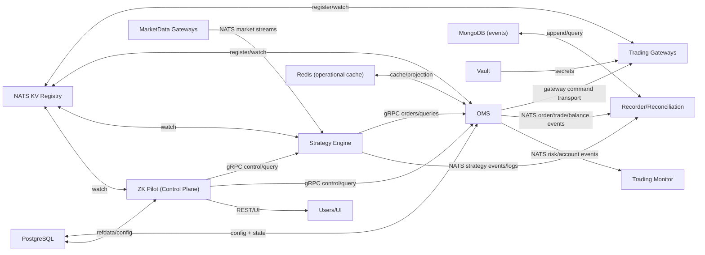

# ZKBot Architecture

This is the entry point for the architecture docs.

Topic-specific design notes live alongside it:

- [Service Discovery](/Users/zzk/workspace/zklab/zkbot/docs/system-arch/service_discovery.md)
- [RTMD Subscription Protocol](/Users/zzk/workspace/zklab/zkbot/docs/system-arch/rtmd_subscription_protocol.md)
- [API Contracts](/Users/zzk/workspace/zklab/zkbot/docs/system-arch/api_contracts.md)
- [Proto](/Users/zzk/workspace/zklab/zkbot/docs/system-arch/proto.md)
- [Data Layer](/Users/zzk/workspace/zklab/zkbot/docs/system-arch/data_layer.md)
- [SDK](/Users/zzk/workspace/zklab/zkbot/docs/system-arch/sdk.md)
- [Rust Crates](/Users/zzk/workspace/zklab/zkbot/docs/system-arch/rust_crates.md)
- [Operations](/Users/zzk/workspace/zklab/zkbot/docs/system-arch/ops.md)
- [Registry Security](/Users/zzk/workspace/zklab/zkbot/docs/system-arch/registry_security.md)
- [Topology Registration](/Users/zzk/workspace/zklab/zkbot/docs/system-arch/topology_registration.md)
- [Service Architecture Docs](/Users/zzk/workspace/zklab/zkbot/docs/system-arch/services/README.md)

## 1. Objectives

- Build a stable core for strategy execution and OMS/risk while allowing different deployment shapes.
- Keep transport pluggable, with a default of:
  - `gRPC` for request/response control and query flows
  - `NATS` for event fanout and async workflows
- Support strategy styles from low-frequency portfolio workflows to latency-sensitive execution.
- Keep operator UX simple via one control plane and one SDK with minimal configuration.

## 2. Architecture Principles

- Core domain logic is deterministic and transport-agnostic.
- State ownership is explicit; write paths are authoritative and bounded.
- Service discovery is dynamic and lease-based.
- APIs are contract-first (protobuf), language-agnostic, and versioned.
- Runtime modes differ by composition, not by business semantics.

## 3. Runtime Stack

- Hot path services: Rust.
- Integration, orchestration, analytics, and optional strategy runtime: Python (plus optional Go/Java where fit-for-purpose).
- Wire contract: Protobuf.
- RPC: gRPC.
- Messaging: NATS.
- Registry/discovery: NATS KV (lease + heartbeat records).
- Cache/state acceleration: Redis.
- Relational source of truth: PostgreSQL.
- Event/document store: MongoDB (event-first usage only).
- Secrets: Vault.

## 4. Planes

### 4.1 Control Plane

- `ZK Pilot Service` (global):
  - user/API-facing control endpoints
  - query aggregation
  - lifecycle controls (engine/strategy/OMS)
  - configuration workflows (accounts, risk, subscriptions, jobs)

### 4.2 Data Plane

- `Strategy Engine` instances
- `OMS` instances
- `Trading Gateway` instances (one account per gateway instance)
- `MarketData Gateway` instances (venue-scoped)
- `Recorder + Reconciliation` services
- `Trading Monitor` services

## 5. Core Service Model

### 5.1 Strategy Engine

- Runs one or more strategies (embedded or standalone runtime mode).
- Consumes market/account/order events from NATS.
- Sends order/cancel/query intents to OMS via gRPC.
- Exposes lifecycle and health gRPC endpoints.

### 5.2 OMS (Order Management + Risk)

- Owns account-scoped risk checks and order lifecycle.
- Talks to gateways for execution.
- Exposes gRPC command/query APIs for engines and control plane.
- Publishes normalized order/trade/balance/position events to NATS.
- Registers its gRPC endpoint in NATS KV keyed by `oms_id`.

### 5.3 Trading Gateway

- External venue connectivity boundary.
- One gateway instance per account.
- On startup, declares:
  - transport metadata (protocol/endpoint/capabilities)
  - account metadata (account id, venue, permissions)
  into NATS KV with TTL/heartbeat.

### 5.4 MarketData Gateway

- Venue-scoped market-data ingestion and normalization.
- Uses dynamic subscription intent from control/data plane.
- Publishes normalized ticks/bars/orderbook streams on NATS.

### 5.5 Recorder + Reconciliation

- Event capture and audit materialization.
- Reconciliation workflows:
  - OMS state vs gateway/account state
  - trade/balance/position consistency checks

### 5.6 Trading Monitor

- Risk and health monitors over live streams.
- Policy-driven alerting and escalation.

## 6. Service Discovery And Startup Contracts

### 6.1 Registry Structure (NATS KV)

- `svc.gw.<gw_id>`: gateway transport/account declaration
- `svc.oms.<oms_id>`: OMS transport declaration
- `svc.engine.<engine_id>`: engine transport declaration (optional for inbound control)
- `svc.sim.<sim_id>`: simulator declaration

Each record includes:
- `service_type`, `instance_id`
- `transport` (`grpc`, `nats`, hybrid)
- endpoint fields (host/port/authority)
- account/venue/capability metadata
- `lease_expiry` and heartbeat timestamp

### 6.2 Startup Sequence

1. Gateway starts and registers `svc.gw.*` with account + transport metadata.
2. OMS starts:
   - loads account/OMS config from PostgreSQL
   - discovers required gateways from `svc.gw.*`
   - establishes connectivity to selected gateways
   - registers `svc.oms.<oms_id>` gRPC metadata
3. Engine starts:
   - loads strategy config to select target `oms_id`
   - resolves `svc.oms.<oms_id>`
   - opens gRPC channel to OMS
4. Pilot/monitor/recorder services watch KV for live topology changes.

## 7. Data Ownership And Storage Boundaries

### 7.1 PostgreSQL (authoritative relational state)

- account config and OMS routing config
- risk config and policy config
- refdata and static instrument metadata
- orders/trades/positions/balances (query and reporting model)

### 7.2 MongoDB (event/document store only)

- strategy events/logs/signals
- raw normalized execution/market events for replay/audit
- append-first schema with retention tiers

### 7.3 Redis (fast operational state)

- low-latency projections/caches used by services
- OMS warm-start cache and non-critical read replica for Pilot/UI
- ephemeral coordination and rate-limited counters
- no long-term system-of-record role

## 8. `trading_sdk` (tqClient successor)

Single SDK to abstract OMS and market-data capabilities with minimal config.

- Minimal required inputs:
  - environment
  - account id(s)
  - NATS bootstrap URL
- SDK responsibilities:
  - discover OMS endpoint via NATS KV
  - establish gRPC channels
  - expose high-level order/query/subscribe APIs
  - hide retries, failover, and schema translation

## 9. Deployment Modes

### 9.1 Three-layer
- Strategy Engine + OMS + Gateway
- best for low/medium frequency and strong isolation

### 9.2 Two-layer
- Strategy Engine + OMS with gateway plugins
- best for latency-sensitive but still modular setups

### 9.3 All-in-one
- strategy + OMS + connectivity in one process
- best for strict latency budgets

All modes preserve the same protobuf contracts and domain semantics.

## 10. Reliability And Failure Semantics

- Lease-based discovery entries expire automatically.
- Consumers maintain watch-based endpoint refresh.
- gRPC clients use backoff+jitter reconnect and circuit breaking.
- NATS publishers/subscribers support replay/idempotency where needed.
- OMS enforces idempotent command handling and deterministic state transitions.

## 11. Security Model

- Vault is the source of truth for exchange/API/private key secrets.
- Services use short-lived auth to fetch secrets and cache locally with TTL.
- Transport security: TLS for gRPC and NATS.
- Vault stores only exchange account credentials (API keys, private keys) used by Trading Gateways.
- All other services use env-supplied config; no Vault access needed.

## 12. Observability And SLOs

- Unified tracing across gRPC and NATS hops.
- Per-service metrics:
  - command latency (p50/p95/p99)
  - event lag and queue depth
  - reconciliation mismatch counts
  - discovery churn and reconnect rates
- Structured logs with correlation ids (`strategy_id`, `order_id`, `account_id`, `oms_id`, `gw_id`).

## 13. Logical View

## 14. Reusable Rust-Port Components

The redesign should directly reuse existing Rust crates and only add transport/integration adapters where needed.

### 14.1 Reuse map

- `zk-oms-rs`:
  - reuse as OMS domain core (order lifecycle, balances/positions, risk/config handling).
  - remains transport-agnostic and should sit behind new gRPC service layer.
- `zk-engine-rs`:
  - reuse as live strategy event loop core (event coalescing, timer, action dispatch).
  - plug new OMS gRPC dispatcher + NATS event adapters into existing dispatcher/event-source boundaries.
- `zk-strategy-sdk-rs`:
  - reuse as strategy runtime kernel and common model layer.
  - keep as shared contract between backtest and live runtime.
- `zk-backtest-rs`:
  - reuse as deterministic backtest core and simulation kernel.
  - remains part of research/backtest runtime, not core live control plane.
- `zk-pyo3-rs`:
  - reuse as Python interop bridge for strategy/backtest compatibility.
  - provides compatibility path for existing Python strategies and future SDK bindings.
- `zk-proto-rs`:
  - reuse as generated protobuf type source for all Rust services.
- `zk-infra-rs`:
  - use as the integration crate for:
    - gRPC servers/clients
    - NATS pub/sub adapters
    - NATS KV discovery client/watcher
    - Redis/PostgreSQL/Mongo/Vault connectors

### 14.2 New components needed around existing crates

- OMS gRPC service host wrapping `zk-oms-rs`.
- Engine action dispatcher implementation that calls OMS via gRPC.
- NATS KV registry library (lease heartbeat + watch cache) in `zk-infra-rs`.
- Unified `trading_sdk` client layer (likely Rust first, optional Python bindings).

### 14.3 Design constraint

- Do not move domain logic into transport/service crates.
- Domain crates (`zk-oms-rs`, `zk-engine-rs`, `zk-strategy-sdk-rs`, `zk-backtest-rs`) stay infra-agnostic.
- Transport/discovery/storage/security concerns are implemented in adapters (`zk-infra-rs` + service binaries).
