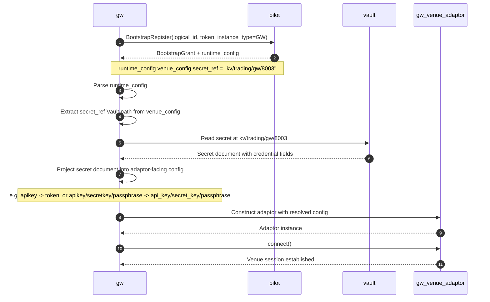

# Bootstrap And Runtime Config

## Decision

All services should use the same bootstrap shape.

Bootstrap is the control-plane step that:

- authenticates the service identity
- authorizes whether the logical instance may start
- returns the effective runtime configuration
- returns registration/session metadata
- returns secret references, not secret material

This rule applies across gateway, OMS, engine, market data gateway, and other managed services.

All bootstrap-managed services should also follow one shared config-management contract:

- Pilot owns the desired runtime config
- the desired config is validated against a manifest/schema contract for that service kind
- the runtime applies that desired config as its effective config after bootstrap or reload
- the runtime exposes a default `GetCurrentConfig` style query so Pilot can inspect the live effective
  config

This should be understood as three explicit config layers:

- `bootstrap_config`
  - minimal startup inputs supplied by deployment/orchestration
- `provided_config`
  - control-plane config returned and managed by Pilot
- `runtime_config`
  - the effective config actually active inside the process

## Rationale

Using one bootstrap model reduces service-specific startup logic and keeps the control-plane
contract stable.

It also keeps concerns separated:

- deployment tooling owns only minimal bootstrap inputs
- Pilot owns effective runtime configuration and start authorization
- Vault owns secret material
- NATS KV owns runtime liveness

That split avoids:

- large per-service env/file configs drifting over time
- Pilot becoming a secret-distribution hub
- services becoming live before they have loaded required config and secrets

## Config Layers

### Overview

Each bootstrap-managed service should conceptually operate with three config shapes:

1. `bootstrap_config`
2. `provided_config`
3. `runtime_config`

Ownership rule:

- orchestrator/deployment owns `bootstrap_config`
- Pilot owns `provided_config`
- the runtime owns the final assembled `runtime_config`

Compatibility rule:

- in Pilot-bootstrap mode:
  - `runtime_config = bootstrap_config + provided_config + runtime-derived values`
- in direct startup mode:
  - `runtime_config = bootstrap_config + provided_config`, but both are supplied through env vars,
    files, or equivalent local deployment inputs

This preserves direct startup compatibility without changing the logical config model. The field
model stays the same; only the source of the fields changes.

### 1. Bootstrap Config

This is deployment-owned and intentionally small.

It should include only what the process needs to reach Pilot and Vault and identify itself.

Typical fields:

- `env`
- Pilot bootstrap endpoint
- NATS bootstrap endpoint if needed before enriched config is returned
- Vault endpoint and auth method bootstrap info
- workload identity inputs
- bootstrap token path or logical instance identity input
- local dev override flags if needed

It should not include the full Pilot-managed service config or raw secrets.

In direct mode, deployment tooling may still supply more fields via env vars for compatibility, but
those additional fields should be treated as a direct-mode source for `provided_config`, not as a
redefinition of what belongs in `bootstrap_config`.

### 2. Provided Config

This is Pilot-owned control-plane config returned during bootstrap.

It should match the manifest/schema contract for the service kind and, where applicable, the venue
capability.

It may include:

- generic service config managed by Pilot
- service-specific config payload
- topology bindings
- venue/account scope
- capability flags
- registration metadata
- `secret_ref`

The service should incorporate this into its effective `runtime_config` after bootstrap.

### 3. Runtime Config

This is the effective config actually loaded by the process.

It is the config the runtime should report via `GetCurrentConfig`.

It may include:

- all `bootstrap_config` fields that remain relevant at runtime
- all `provided_config` fields returned by Pilot
- runtime defaults
- derived fields
- orchestrator-injected environment-specific values

Recommended rule:

- `runtime_config` is an observed/effective shape, not the primary authoring shape
- Pilot should compare desired `provided_config` against live `runtime_config`
- secret material must be redacted from `GetCurrentConfig`

### 4. Manifest-Driven Desired Config

The `provided_config` shape should be defined by a manifest/schema contract, not by ad hoc UI forms
or service-local environment variables.

Recommended rule:

- every bootstrap-managed service kind should declare a config manifest
- venue-backed services such as `gw`, `mdgw`, and refdata should use the venue integration manifest
- non-venue services such as `oms`, `engine`, and other managed runtimes should use a service-kind
  manifest/schema contract with the same logical purpose
- services that host pluggable workloads such as `engine` may also need a second manifest layer for
  the hosted workload itself, such as strategy manifests keyed by `strategy_type_key`
- the bundled manifest/schema shipped with the codebase or binary is the authoritative contract
- any Pilot-stored schema/manifest metadata is an operational mirror/registry of that authoritative
  contract, not an independent authoring source

The manifest/schema contract should define:

- supported config fields and their types
- defaults and enum values where appropriate
- capability flags
- which fields are reloadable vs restart-required
- which fields are secret references vs ordinary config
- which fields conceptually belong to `provided_config` rather than `bootstrap_config`

Hosted-workload rule:

- when one managed service hosts multiple workload families behind one runtime, keep the contracts
  split
- example:
  - engine host config belongs to the engine service-kind manifest/schema
  - strategy config belongs to the selected strategy manifest/schema
- Pilot may compose multiple schemas in the UI, but it should not flatten them into one
  undifferentiated authoring contract

Python-wrapper rule:

- a generic Python-wrapper strategy may use one outer strategy manifest/schema for wrapper fields
- the wrapped Python strategy config may remain a nested JSON payload
- when a strategy-specific Python schema exists, Pilot should validate that nested payload too

Pilot should use this manifest/schema contract to:

- render config authoring forms
- validate `provided_config` before persistence
- classify drift and change impact
- decide whether a change can be applied by reload or requires restart

Operational registry rule:

- Pilot may persist manifest/schema metadata for version listing, activation state, audit, and UI
  queries
- that stored copy should be imported or synchronized from the bundled authoritative manifests
- if the bundled manifest/schema and the active Pilot registry copy do not match for the same
  resource, Pilot should fail closed for related config operations rather than silently continuing

### 5. Runtime Config Introspection

Every bootstrap-managed runtime should expose a default `GetCurrentConfig` style query.

Purpose:

- let Pilot inspect the currently loaded effective runtime config
- compare desired `provided_config` in control-plane storage against live effective config
- expose operator-visible drift information
- support reload/restart decisions

Recommended response contents:

- normalized effective config payload
- service/runtime config revision or version if available
- `loaded_at`
- `config_source`
- reloadability metadata if the runtime knows it
- optional config hash

Security rule:

- `GetCurrentConfig` must redact secret material
- secret references may be returned, but raw secret values must not be returned

## Bootstrap Token Decision

The default bootstrap authentication model is:

- every managed service uses a bootstrap token
- the bootstrap token is distributed by deployment tooling as part of the minimal deployment config
- the token is used only for Pilot bootstrap

Recommended guardrails:

- scope the token to:
  - `logical_id`
  - `instance_type`
  - `env`
- store only the token material or token file path in deployment-managed secrets/config
- rotate the token through normal deployment rollout
- do not reuse bootstrap tokens as general runtime API credentials

Why this is the default:

- simplest to implement and operate
- works uniformly across gateway, OMS, engine, and RTMD gateway
- keeps Vault focused on runtime secrets instead of bootstrap complexity
- matches the minimal deployment config model

## Alternative Bootstrap Identity Models

These are valid later options, but not the default design:

- workload-identity-issued bootstrap assertion
  - the service proves identity from Kubernetes/workload identity and exchanges that for a short-lived bootstrap grant
- Vault-backed bootstrap secret retrieval
  - deployment config contains only enough identity to read a bootstrap token from Vault first
- mTLS or SPIFFE-style service identity bootstrap
  - service uses platform-issued cert identity instead of a pre-distributed token
- short-lived bootstrap token minting service
  - deployment or operator workflow requests an ephemeral token shortly before startup

These alternatives improve credential hygiene, but they add platform and operational complexity.
The phase-1 design should stay with deployment-distributed bootstrap tokens.

## Secret Rule

Bootstrap must not return raw secrets.

Instead:

- Pilot returns `secret_ref` metadata
- the service authenticates directly to Vault using workload identity
- the service reads secret material from Vault

This applies to all services that need private credentials, especially trading gateways.

### Runtime secret loading contract

The default runtime contract is:

- Pilot returns only Vault secret path references in desired/runtime config
- the runtime host resolves those references before constructing venue/client adaptors
- the shared Vault/infra layer reads the referenced secret document as generic key/value data
- the runtime host projects that secret document into the adaptor-facing enriched config
- adaptors should receive resolved secret fields such as `token`, `api_key`, `secret_key`, or
  `passphrase`, not Vault client logic

Recommended layering:

- Pilot owns desired config and reference metadata
- Vault owns secret material
- the shared infra layer owns Vault transport and document retrieval
- the runtime host owns secret-to-config projection and enrichment
- venue adaptors own venue protocol logic only

For this contract, `secret_ref` is a Vault path reference by convention, for example:

- `kv/trading/gw/8003`
- `kv/trading/gw/9001`

The runtime host should treat that value as directly readable from Vault rather than introducing a
second logical-ref-to-path mapping layer.

Projection rule:

- the Vault layer should return the secret document as generic JSON/object data
- the runtime host may rename, select, or normalize fields when enriching adaptor config
- the runtime host should not blindly flatten every Vault field into runtime config
- venue adaptors should read only their intended config keys

Example:

- Vault document at `kv/trading/gw/8003`
  - `apikey`
- host-enriched adaptor config
  - `token`

That mapping belongs in the host integration layer, not in the shared Vault/infra library.

This keeps secret handling consistent across:

- local process orchestration for dev/debug
- future Kubernetes or k3s orchestration
- different venue adaptor implementations

Example gateway startup flow:

### Runtime identity and Vault access

For the current design, the preferred runtime access pattern is:

- Pilot provisions runtime Vault access material as part of an ops workflow
- the orchestrator injects Vault auth bootstrap inputs into the service
- the service authenticates to Vault directly at startup

The recommended initial auth mechanism is AppRole with short-lived `secret_id` material.

AppRole deployment rule:

- application code and config schemas should stay environment-agnostic
- environment-specific Vault address, `role_id`, and `secret_id` are injected by the selected
  orchestrator backend

Pilot should not return a long-lived generic Vault token in bootstrap responses.

### Secret reference shape

Pilot should persist and return `secret_ref` as the Vault path reference the runtime is expected to
read directly.

Recommended form:

- `kv/trading/gw/<account_id>`

The `secret_ref` value should identify the Vault secret document, while the runtime host determines
which credential fields from that document are injected into the adaptor config.
- logical instance id
- venue/account identity from enriched runtime config

This keeps Pilot config portable across local and k3s deployment modes.

## Direct Mode Compatibility

Direct startup mode remains a supported compatibility mode.

Rule:

- the service should still assemble the same conceptual `runtime_config`
- the only difference is that `provided_config` is supplied locally through env vars, files, or
  other deployment inputs instead of being returned by Pilot bootstrap

This allows:

- local debugging without Pilot
- incremental migration from env-only services to Pilot-managed services
- one internal runtime config model across both modes

Recommended implementation direction:

- keep one canonical internal runtime config model per service
- in direct mode, parse env vars into that model directly
- in Pilot mode, parse minimal bootstrap env, then merge in Pilot-returned `provided_config`

Documentation rule:

- service schemas should primarily describe `provided_config`
- service docs may separately document direct-mode env var mappings for backward compatibility
- bootstrap-only fields should not be mixed into the service-kind schema unless they are also part
  of the canonical Pilot-managed field model

## Unified Startup Contract

The recommended startup sequence for any managed service is:

1. start with minimal deployment config
2. authenticate to Pilot using the bootstrap identity/token
3. receive bootstrap grant plus effective enriched runtime config
4. authenticate to Vault using injected runtime identity
5. fetch required secrets from Vault using `secret_ref`
6. resolve adaptor/client config in memory only
7. initialize internal runtime/adaptors/clients
8. register live endpoint/state in NATS KV
9. begin serving traffic or publishing data

If any step before KV registration fails, the service should fail startup without becoming live.

## Unified Shutdown Contract

The recommended shutdown sequence is:

1. stop accepting new work
2. withdraw or delete the live KV registration
3. notify Pilot if graceful deregistration is supported
4. stop background loops and exit

Hard shutdown is handled by KV lease loss and Pilot reconciliation, not by a special service-local
contract.

## Drift And Restart Policy

Pilot should compare:

- desired config from control-plane storage
- current effective config from the runtime `GetCurrentConfig` query

Decision rule:

- if there is no material diff, Pilot should not trigger change
- if the diff is within fields marked reloadable by the manifest/schema contract, Pilot may issue
  reload
- if the diff touches restart-required fields, Pilot should surface restart-required state and let
  the operator trigger restart explicitly

Pilot should not infer reload vs restart from UI heuristics alone.

## Notes

- Service-specific docs may refine what the enriched config contains.
- Service-specific docs should not redefine the overall bootstrap shape unless there is a clear
  exception.

## Related Docs

- [Architecture](/Users/zzk/workspace/zklab/zkbot/docs/system-arch/arch.md)
- [Service Discovery](/Users/zzk/workspace/zklab/zkbot/docs/system-arch/service_discovery.md)
- [Pilot Service](/Users/zzk/workspace/zklab/zkbot/docs/system-arch/services/pilot_service.md)
- [Gateway Service](/Users/zzk/workspace/zklab/zkbot/docs/system-arch/services/gateway_service.md)
- [Engine Service](/Users/zzk/workspace/zklab/zkbot/docs/system-arch/services/engine_service.md)
- [Market Data Gateway Service](/Users/zzk/workspace/zklab/zkbot/docs/system-arch/services/market_data_gateway_service.md)
