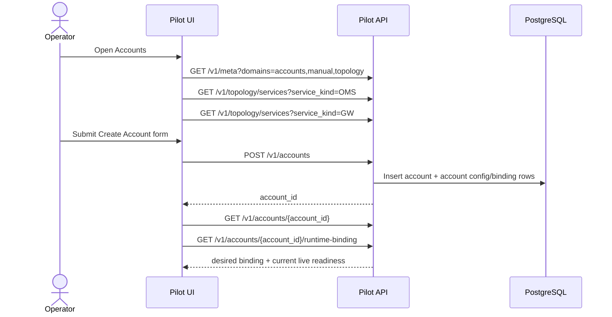
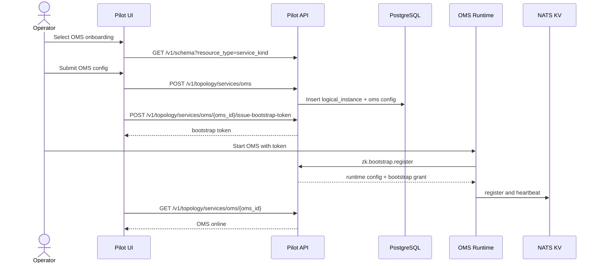
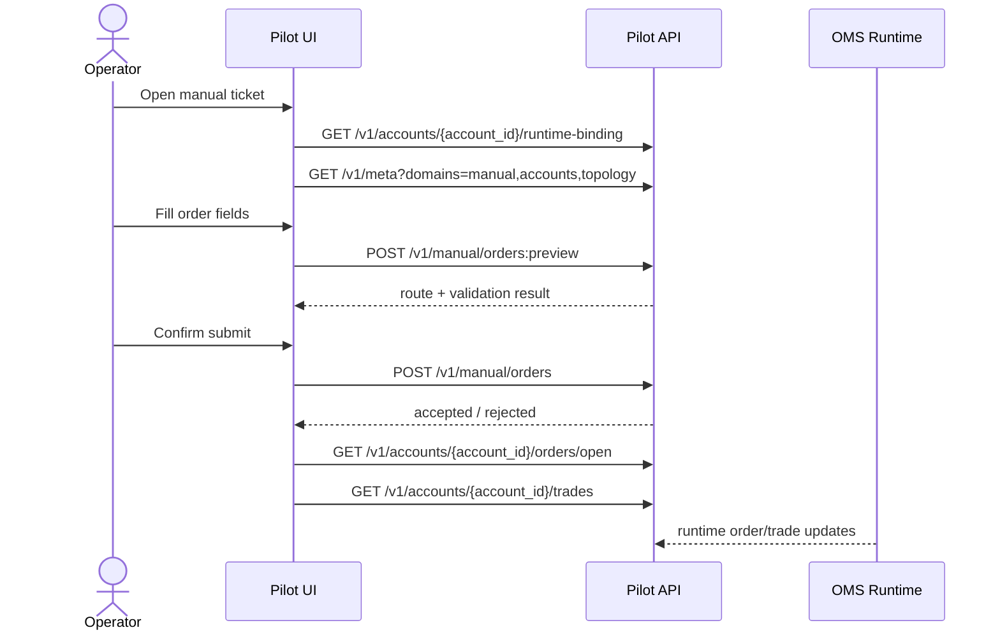
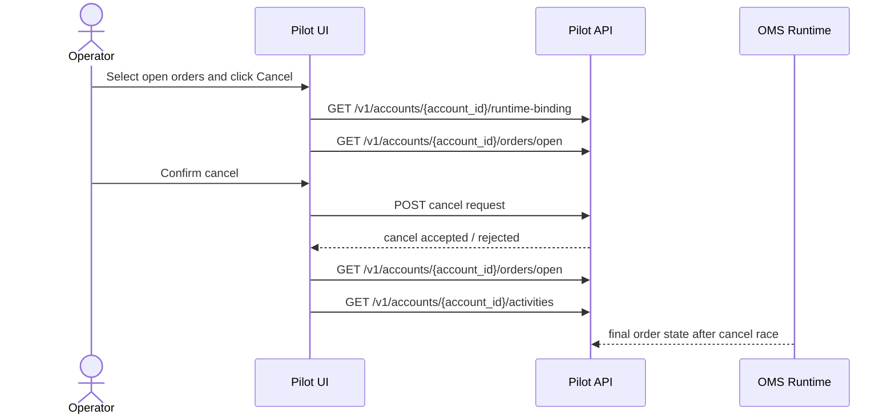

# Pilot UI Interaction Design

## Purpose

This document describes the operator-facing control-plane UI sequences for Pilot.

Focus:

- account onboarding
- OMS / GW / MDGW onboarding
- other major onboarding and bootstrap operations

Assumption:

- the environment starts empty
- no accounts exist
- no services are configured
- no runtimes are live in discovery
- no topology is operational yet

This is a UI-operation document, not a complete API catalog. The canonical REST and bootstrap
contracts remain in [Pilot Service](/Users/zzk/workspace/zklab/zkbot/docs/system-arch/services/pilot_service.md).

## Design Goals

The Pilot UI should guide operators through a bring-up order that matches the actual control-plane
dependencies.

The intended operator journey is:

1. provision schema/meta context
2. provision secrets and account records
3. onboard service definitions and desired config
4. issue bootstrap tokens where needed
5. start runtimes outside or through Pilot orchestration
6. observe live registration and topology readiness
7. only then enable manual trading, account live views, and bot operations

The UI should make the distinction explicit between:

- configured in control plane
- bootstrappable
- live in discovery
- operationally ready

## Empty Environment Model

At initial startup, the UI should assume:

- `/v1/meta` is available
- `/v1/schema` is available
- Pilot itself is healthy
- no OMS is online
- topology views are empty or near-empty
- manual trading actions are disabled
- account live views are disabled
- bot execution actions are disabled

The default landing state should steer the operator into onboarding rather than showing an “error”
topology.

Recommended empty-state entry points:

- `Accounts`
- `Onboard Service`
- `Schema / Meta`
- `Ops Bootstrap Checklist`

## Common UI Interaction Pattern

Most onboarding flows should use the same 5-stage UI pattern:

1. select service kind / scope
2. load metadata and schema
3. fill desired config and bindings
4. persist control-plane state
5. guide runtime bootstrap and verify live registration

Shared backend reads used by these flows:

- `GET /v1/meta`
- `GET /v1/schema`
- `GET /v1/topology/services`
- `GET /v1/topology/sessions`
- `GET /v1/topology/views/{view_name}`

Shared backend writes used by these flows:

- `POST /v1/accounts`
- `PUT /v1/accounts/{account_id}`
- `POST /v1/topology/services/{service_kind}`
- `PUT /v1/topology/bindings`
- `POST /v1/topology/services/{service_kind}/{logical_id}/issue-bootstrap-token`

## Readiness States

The UI should present service and account bring-up through explicit readiness states.

Suggested service readiness model:

- `draft`
  - no control-plane row yet
- `configured`
  - control-plane metadata and desired config stored
- `bootstrap-ready`
  - required secrets/bindings exist and bootstrap token can be issued
- `starting`
  - operator or orchestrator has launched the runtime
- `online`
  - runtime is live in discovery
- `degraded`
  - control-plane row exists but runtime is offline or drifted

Suggested account readiness model:

- `draft`
- `configured`
- `bound`
  - account is mapped to OMS / GW as required
- `live-view-ready`
  - target OMS is online and account runtime binding resolves
- `tradable`
  - manual order preview and order submit are enabled

## Sequence 1: Account Onboarding

### Goal

Create an account record, attach the right venue/runtime bindings, and reach a state where account
live views and manual trading can later be enabled.

### UI Steps

1. Open `Accounts` from an empty state.
2. UI loads:
   - `GET /v1/meta?domains=accounts,manual,topology`
   - optionally `GET /v1/topology/services?service_kind=OMS`
   - optionally `GET /v1/topology/services?service_kind=GW`
3. Operator clicks `Create Account`.
4. UI renders a form using:
   - static account fields
   - dropdowns from `/v1/meta`
   - topology-backed selectors for OMS/GW where already configured
5. Operator enters:
   - account identity
   - venue
   - account label / external account code
   - desired OMS binding
   - desired GW binding if relevant
   - optional manual trading flags / risk defaults
6. UI submits:
   - `POST /v1/accounts`
7. Pilot stores the account row and any related account configuration rows.
8. UI then fetches:
   - `GET /v1/accounts/{account_id}`
   - `GET /v1/accounts/{account_id}/runtime-binding`
9. If OMS/GW are not yet online, UI marks the account as:
   - configured but not live-view-ready
10. Once OMS is later live, UI enables:
   - balances
   - positions
   - open orders
   - activities
   - manual order preview

### UI Notes

- account creation should not require OMS to be online
- live account widgets should remain disabled until runtime binding resolves
- account detail should clearly separate:
  - desired control-plane binding
  - current runtime binding

### Sequence Sketch

## Sequence 1A: Account Editing

### Goal

Allow operators to update account control-plane configuration, but only when the related runtime
scope is not online.

### Backend Rule

The backend should only accept account-edit operations when the related service/runtime scope is not
online.

For the current phase, the UI should assume:

- if the related OMS workspace is live, account edits are blocked
- if the account resolves to a live runtime binding, account edits are blocked

### UI Steps

1. Operator opens account detail.
2. UI loads:
   - `GET /v1/accounts/{account_id}`
   - `GET /v1/accounts/{account_id}/runtime-binding`
   - `GET /v1/meta?domains=accounts,topology`
3. UI determines whether edit is allowed.
4. If the account is bound into a live OMS scope:
   - disable `Edit`
   - show why editing is blocked
   - optionally link to topology/service status
5. If the account is not live-bound:
   - enable `Edit`
6. Operator updates desired account fields and bindings.
7. UI submits:
   - `PUT /v1/accounts/{account_id}`
8. UI refreshes:
   - `GET /v1/accounts/{account_id}`
   - `GET /v1/accounts/{account_id}/runtime-binding`

### UI Notes

- editing should be a control-plane operation only
- UI should not let the operator discover the “must be offline” rule only after a failed submit
- if runtime is online, the preferred UX is:
  - stop or detach the relevant live scope first
  - then edit

## Sequence 2: OMS Onboarding

### Goal

Define an OMS logical instance and its desired runtime config so the runtime can later bootstrap and
become the anchor scope for topology, account live views, and manual trading.

### UI Steps

1. Open `Onboard Service`.
2. Select service kind `OMS`.
3. UI loads:
   - `GET /v1/meta?domains=topology`
   - `GET /v1/schema?resource_type=service_kind`
4. UI loads the OMS manifest/schema contract and renders:
   - logical id
   - environment-scoped host/runtime config
   - service bindings
   - secret-ref fields if any
5. Operator enters desired OMS config.
6. UI submits:
   - `POST /v1/topology/services/oms`
7. Pilot stores:
   - `cfg.logical_instance`
   - OMS-specific desired config row
8. UI offers `Issue Bootstrap Token`.
9. UI calls:
   - `POST /v1/topology/services/oms/{oms_id}/issue-bootstrap-token`
10. Operator starts OMS externally.
11. OMS calls Pilot bootstrap/register and then registers into discovery.
12. UI polls or refreshes:
   - `GET /v1/topology/services/oms/{oms_id}`
   - `GET /v1/topology/sessions`
13. Once OMS is online, the UI marks the OMS scope as topology-ready.

### UI Notes

- OMS onboarding should succeed even with no GW or accounts yet
- OMS online status should unlock OMS-scoped topology entry
- account pages may still be non-live if no account is bound to this OMS

### Sequence Sketch

## Sequence 2A: Service Editing

### Goal

Allow operators to edit desired service config and bindings only when the target service is not
currently online.

### Backend Rule

For the current phase, backend editing of service config should only be allowed when the related
service is offline.

This applies to service kinds such as:

- OMS
- GW
- MDGW
- other Pilot-managed services whose desired config is stored in control-plane tables

### Common UI Edit Pattern

1. Operator opens service detail.
2. UI loads:
   - `GET /v1/topology/services/{service_kind}/{logical_id}`
   - `GET /v1/topology/services/{service_kind}/{logical_id}/bindings`
   - `GET /v1/schema`
   - `GET /v1/meta?domains=topology`
3. UI checks:
   - `liveStatus`
   - config drift
   - session presence
4. If service is online:
   - disable `Edit Config`
   - disable binding edits if they would mutate active runtime intent
   - explain that the service must be offline before editing
5. If service is offline:
   - enable `Edit Config`
   - render the same schema-driven form used for onboarding
6. Operator submits updated desired config.
7. UI submits the appropriate service update request.
8. UI refreshes service detail and keeps the service in `configured/offline` state until restarted.

### UI Notes

- editing and reloading are separate operations
- offline edit changes desired state
- restart/rebootstrap is required for the changed desired state to become live
- UI should show:
  - current live status
  - desired config changed
  - runtime restart/bootstrap required

### OMS Editing

Recommended interaction:

1. Open OMS detail page.
2. If OMS is online:
   - disable editing
   - allow only read-only inspection plus operational actions like reload where supported
3. If OMS is offline:
   - render OMS service-kind schema form
   - allow binding updates
4. After save, UI should offer:
   - issue new bootstrap token if needed
   - restart/bootstrap checklist

### GW Editing

Recommended interaction:

1. Open GW detail page.
2. If GW is online:
   - disable editing
3. If GW is offline:
   - render composite edit form:
     - service-kind host config
     - venue capability config
     - bindings
4. After save, UI should mark:
   - desired config updated
   - runtime restart/bootstrap required

### MDGW Editing

Recommended interaction:

1. Open MDGW detail page.
2. If MDGW is online:
   - disable editing
3. If MDGW is offline:
   - render composite edit form
4. After save, UI should show:
   - config updated
   - runtime not yet restarted

## Sequence 3: Gateway Onboarding

### Goal

Create a venue gateway logical instance with both host config and venue-specific config, then bring
it online so OMS/account/manual flows can use it.

### UI Steps

1. Open `Onboard Service`.
2. Select service kind `GW`.
3. UI loads:
   - `GET /v1/meta?domains=topology,accounts`
   - `GET /v1/schema`
4. UI renders a composite form:
   - service-host config from service-kind schema
   - venue-specific config from venue capability schema
   - secret-ref inputs
   - desired OMS/account binding selectors
5. Operator enters:
   - logical id
   - venue
   - host/runtime settings
   - venue config
   - bindings to OMS or accounts as applicable
6. UI submits:
   - `POST /v1/topology/services/gw`
7. UI then persists bindings if separate:
   - `PUT /v1/topology/bindings`
8. UI offers `Issue Bootstrap Token`.
9. UI calls:
   - `POST /v1/topology/services/gw/{gw_id}/issue-bootstrap-token`
10. Operator starts the GW runtime.
11. GW bootstraps through Pilot and registers live.
12. UI verifies:
   - `GET /v1/topology/services/gw/{gw_id}`
   - `GET /v1/topology/views/{view_name}?oms_id=...`
13. Once live, UI marks related accounts or OMS bindings as closer to runtime-ready.

### UI Notes

- GW onboarding should visibly distinguish:
  - host/service config
  - venue adaptor config
- if required secret refs are missing, UI should not mark the service as bootstrap-ready
- if GW is configured but offline, account pages should show bound-but-not-live

## Sequence 4: MDGW Onboarding

### Goal

Define MDGW runtime config and bring it online so OMS/GW/bot scopes can consume RTMD later.

### UI Steps

1. Open `Onboard Service`.
2. Select service kind `MDGW`.
3. UI loads:
   - `GET /v1/meta?domains=topology,refdata`
   - `GET /v1/schema`
4. UI renders:
   - host/runtime config
   - venue RTMD capability config
   - secret refs
   - optional initial refdata / RTMD policy linkage
5. Operator submits:
   - `POST /v1/topology/services/mdgw`
6. Pilot stores:
   - logical instance
   - MDGW desired config
7. UI offers bootstrap token issuance:
   - `POST /v1/topology/services/mdgw/{logical_id}/issue-bootstrap-token`
8. Operator starts the MDGW runtime.
9. MDGW bootstraps and registers live.
10. UI later verifies effective use through:
   - topology view
   - RTMD-related status panels

### UI Notes

- MDGW online alone does not make it “in use”
- UI should distinguish:
  - configured
  - online
  - currently subscribed / actively used

## Sequence 5: Bind OMS, GW, Accounts Into A Live Trading Scope

### Goal

Reach the first truly operational control-plane scope.

This is the point where:

- OMS is online
- required GW is online
- account rows exist
- bindings are present

Only after this should manual trading and live account views become operational.

### UI Steps

1. Operator opens topology or onboarding checklist.
2. UI loads:
   - `GET /v1/topology/views/{view_name}?oms_id={oms_id}`
   - `GET /v1/topology/sessions?oms_id={oms_id}`
   - `GET /v1/accounts`
3. UI highlights missing pieces:
   - OMS offline
   - GW offline
   - account not bound
   - drift / secret / bootstrap readiness issue
4. Operator fixes remaining config or starts missing runtimes.
5. Once OMS workspace is complete, UI marks scope as:
   - `operational`
6. UI enables:
   - account live tabs
   - manual order preview
   - manual order submit

## Sequence 6: Manual Trading Enablement

### Goal

Enable manual operations only after the control-plane scope is live.

### Preconditions

- target account exists
- runtime binding resolves to a live OMS scope
- required refdata is available
- OMS workspace is online

### UI Steps

1. Operator opens `Manual`.
2. UI loads:
   - `GET /v1/meta?domains=manual,accounts,topology`
3. UI checks account readiness via:
   - `GET /v1/accounts/{account_id}/runtime-binding`
4. If not ready:
   - disable submit
   - explain whether OMS, GW, or bindings are missing
5. If ready:
   - enable `POST /v1/manual/orders:preview`
   - then `POST /v1/manual/orders`

### UI Notes

- manual submit should never be the mechanism that reveals missing topology setup
- readiness should be visible before the operator fills the full order ticket

## Sequence 6A: Manual Order Placement

### Goal

Let an operator place a manual order only after the target account is tradable and the route is
known to be live.

### Preconditions

- target account is in `tradable` state
- runtime binding resolves to a live OMS scope
- required OMS workspace is online
- required GW route is online if the venue flow depends on it
- required refdata is available and instrument is tradable

### UI Steps

1. Operator opens the manual order ticket for a tradable account.
2. UI loads or refreshes:
   - `GET /v1/meta?domains=manual,accounts,topology`
   - `GET /v1/accounts/{account_id}/runtime-binding`
   - instrument/refdata lookup as needed for the ticket
3. UI shows:
   - desired account binding
   - resolved live OMS/GW binding
   - current account readiness
   - instrument lifecycle / tradability checks
4. Operator enters:
   - account
   - instrument
   - side
   - order type
   - quantity
   - price / tif / tags as needed
5. UI performs preview:
   - `POST /v1/manual/orders:preview`
6. UI renders preview output:
   - resolved route
   - validation or risk warnings
   - final operator confirmation scope
7. Operator confirms submit.
8. UI calls:
   - `POST /v1/manual/orders`
9. UI transitions into active tracking and refreshes:
   - `GET /v1/accounts/{account_id}/orders/open`
   - `GET /v1/accounts/{account_id}/trades`
   - order detail endpoint if exposed
10. UI marks the result as:
   - accepted but not yet live
   - working
   - partially filled
   - filled
   - rejected
   - canceled

### UI Notes

- preview should be a first-class step, not an optional afterthought
- route, readiness, and instrument status should be visible before submit
- the ticket should continue to show whether the resulting order is still cancelable
- submit should remain disabled if readiness drops during ticket entry

### Sequence Sketch

## Sequence 6B: Manual Order Cancel

### Goal

Allow the operator to cancel one or more open manual orders only when the target scope is still
live and the order remains cancelable.

### Preconditions

- target account is at least `live-view-ready`
- OMS runtime binding still resolves
- target order is currently open or otherwise cancelable

### UI Steps

1. Operator opens:
   - account open orders view
   - or manual order result view
2. UI loads:
   - `GET /v1/accounts/{account_id}/orders/open`
   - `GET /v1/accounts/{account_id}/runtime-binding`
3. UI marks cancelability per order using:
   - current order state
   - runtime readiness
4. Operator selects one or more orders and clicks `Cancel`.
5. UI shows confirmation including:
   - account
   - instrument
   - order ids
   - resolved OMS/GW route if useful
6. UI submits:
   - cancel endpoint for the relevant scope
7. UI refreshes:
   - `GET /v1/accounts/{account_id}/orders/open`
   - `GET /v1/accounts/{account_id}/activities`
   - trades if fills may have landed during cancel race
8. UI shows final outcome per order:
   - canceled
   - already filled
   - already canceled
   - reject / failed

### UI Notes

- cancel buttons should be disabled before click if the order is clearly not cancelable
- cancel results should be per-order, not a single undifferentiated success banner
- the UI should expect race conditions between cancel and fill and explain them clearly

### Sequence Sketch

## Sequence 7: Bot / Strategy Onboarding

### Goal

Create strategy definitions and desired runtime config before any execution start is attempted.

### UI Steps

1. Open `Bots`.
2. UI loads:
   - `GET /v1/meta?domains=bot,accounts,topology`
   - `GET /v1/topology/services?service_kind=OMS`
3. Operator creates strategy definition:
   - `POST /v1/bot/strategies`
4. UI allows validation:
   - `POST /v1/bot/strategies/{strategy_key}/validate`
5. If execution uses an orchestrated runtime, the UI should show:
   - desired target OMS/account scope
   - runtime readiness of the target scope
6. Only after required OMS/GW/account topology is live should the UI enable:
   - `POST /v1/bot/executions/start`

### UI Notes

- strategy creation can happen before runtime bring-up completes
- strategy start should be disabled until the target OMS workspace is operational

## Sequence 8: Bot Execution Bootstrap

### Goal

Start a bot execution from Pilot after the rest of the trading scope is already operational.

### UI Steps

1. Operator opens a validated strategy detail page.
2. UI checks:
   - target OMS online
   - required account bindings exist
   - strategy has no conflicting running singleton execution
3. Operator clicks `Start`.
4. UI calls:
   - `POST /v1/bot/executions/start`
5. Pilot allocates execution claim and asks the orchestrator backend to launch the runtime.
6. The launched runtime performs normal bootstrap/register.
7. UI polls:
   - `GET /v1/bot/executions/{execution_id}`
   - `GET /v1/topology/views/{view_name}?oms_id=...`
8. Once execution becomes live, UI unlocks:
   - lifecycle view
   - logs
   - execution activities
   - bot open-order view

## Sequence 9: Re-entering After Partial Bring-Up

Operators will often leave and return before all components are live.

The UI should therefore support a checklist-style re-entry model:

- accounts configured but OMS offline
- OMS online but GW offline
- GW online but account unbound
- OMS/GW live but MDGW not online
- strategy defined but execution target not ready

Recommended dashboard widgets:

- `Configured Accounts Missing Live Binding`
- `Configured Services Not Online`
- `Bootstrap Tokens Recently Issued`
- `OMS Workspaces Missing Required Components`
- `Configured Strategies Not Executable`

## Suggested UI Navigation Order

From an empty environment, the recommended operator order is:

1. `Schema / Meta`
2. `Accounts`
3. `Onboard Service -> OMS`
4. `Onboard Service -> GW`
5. `Onboard Service -> MDGW`
6. `Topology`
7. `Manual`
8. `Bots`

This order should be visible in the product through:

- onboarding checklist cards
- disabled navigation with readiness hints
- empty-state calls to action

## Major UX Rules

The UI should follow these rules consistently:

- do not treat “configured” as “live”
- do not enable manual trading before runtime binding is live
- do not hide topology dependency failures behind late submit-time errors
- always separate desired control-plane state from current runtime state
- show bootstrap readiness separately from online status
- show online status separately from operational readiness

## Suggested Future Extensions

Later, this document can be extended to cover:

- secret provisioning workflows
- refdata refresh and instrument enablement flows
- runtime reload / restart / drift remediation flows
- reconcile and stale-session operator recovery flows
- bot pause/resume/restart UI sequences
- simulator-admin workflows for deterministic gateway control

## Sequence 10: Simulator Operations

### Goal

Give operators a dedicated Pilot workspace for deterministic simulator control without mixing
simulator-only actions into the normal trading or topology flows.

### UI Steps

1. Operator opens `Ops` then `Operate Simulators`.
2. UI loads:
   - `GET /v1/meta?domains=topology`
   - `GET /v1/topology/services?service_kind=GW`
3. UI filters gateway refs to `venue=simulator` and presents a simulator selector.
4. For the selected simulator, UI shows:
   - live/runtime status
   - admin endpoint identity
   - matching state
   - active fault rules
   - open orders
   - staged account state
5. UI groups controls by simulator admin intent:
   - match controls
   - fault injection
   - synthetic market input
   - account-state seeding
   - reset and diagnostics
6. Once Pilot exposes simulator-admin endpoints, these controls should map to a Pilot-backed
   surface that proxies or orchestrates `GatewaySimulatorAdminService`.

### UI Notes

- simulator operations are operator tooling, not part of the normal trading workflow
- the simulator workspace should only appear for simulator-backed gateway instances
- topology readiness and simulator readiness are related but distinct
- a simulator may be `online` in discovery while matching is `paused`
- the page should preserve explicit action intent and payload visibility because these operations
  are commonly used for integration-test and incident-reproduction workflows
