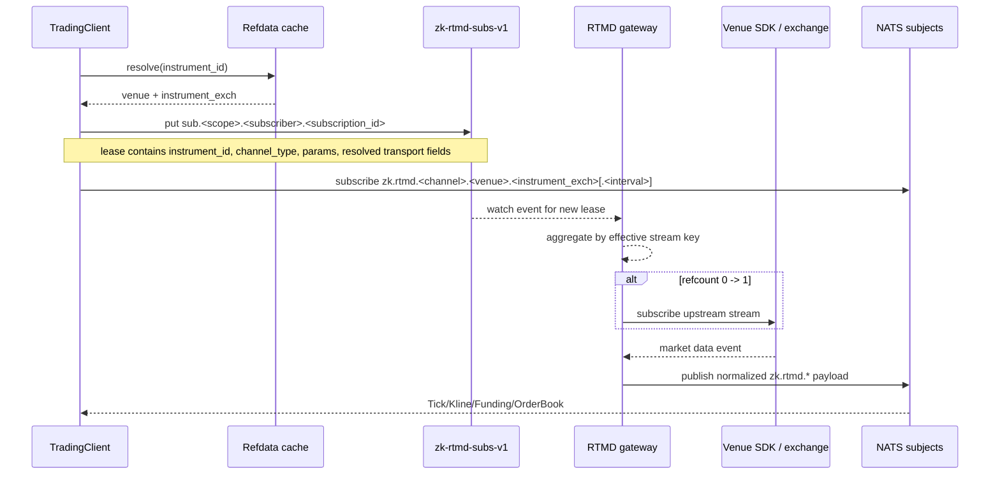
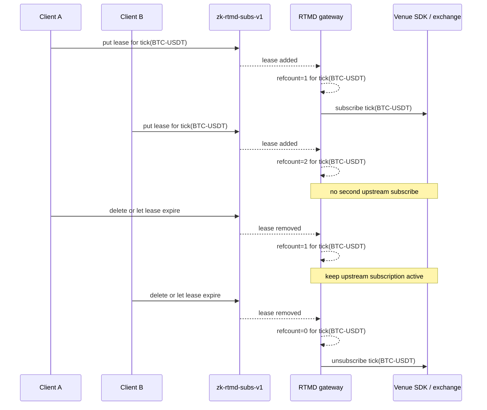
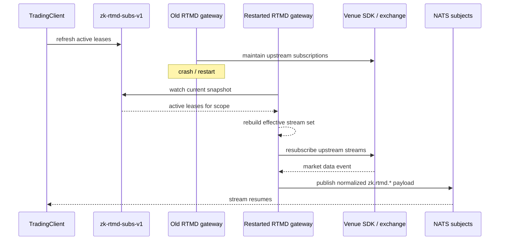
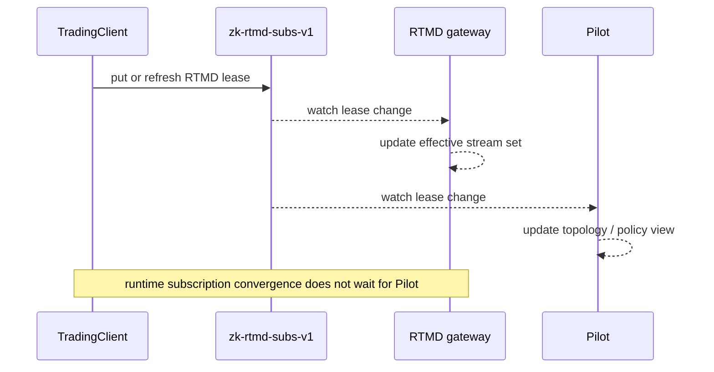
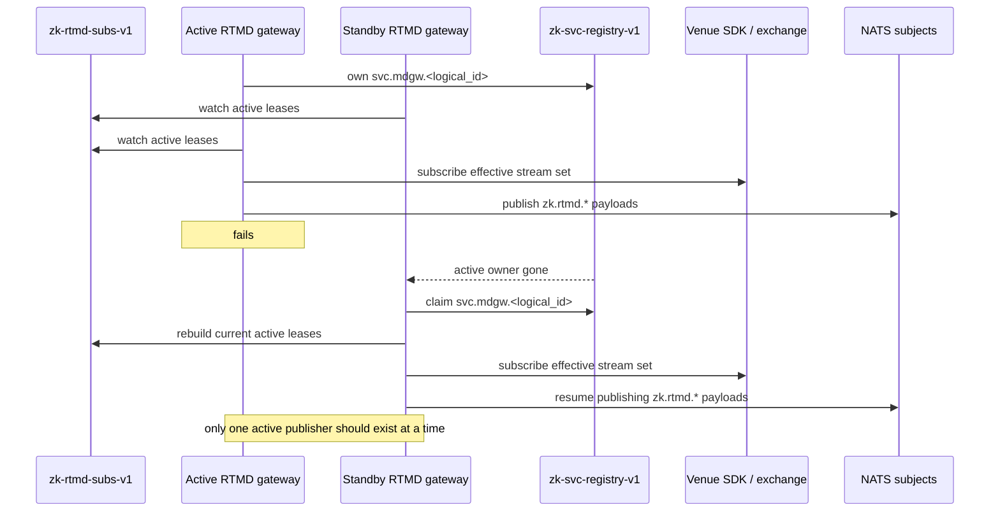

# RTMD Subscription Protocol

This protocol is independent from service discovery.

Purpose:

- let runtime clients express market-data interest quickly
- let RTMD gateways derive effective venue subscriptions
- let SDKs deterministically map market-data interests to NATS subjects
- let Pilot observe and optionally publish its own interest without becoming the runtime hub

## Separation From Service Discovery

- `zk-svc-registry-v1` is for service discovery and liveness
- `zk-rtmd-subs-v1` is for dynamic RTMD subscription leases

The RTMD subscription protocol does not resolve service endpoints. It only expresses market-data
interest and maps that interest to deterministic RTMD topics.

## Interest Model

A client expresses interest in a normalized RTMD stream such as:

- tick
- kline
- funding
- orderbook

Client-facing interest should be expressed in ZK symbol conventions, because the trading client is
already expected to maintain or query instrument refdata.

Preferred identity:

- `instrument_id` as the primary symbol key

Venue-native fields such as `venue` and `instrument_exch` are resolved from refdata and used as
transport-facing details, not as the primary client API.

Each interest record should contain:

- `subscriber_id`
- `scope`
- `instrument_id`
- `channel_type`
- optional channel parameters such as `interval` or `depth`
- resolved transport fields:
  - `venue`
  - `instrument_exch`
- `lease_expiry_ms`
- `updated_at_ms`

Suggested KV bucket:

- `zk-rtmd-subs-v1`

Suggested KV key shape:

- `sub.<scope>.<subscriber_id>.<subscription_id>`

Examples:

- `sub.venue.OKX.strategy_a.tick_btcusdt`
- `sub.logical.engine_strat_1.strategy_a.kline_btcusdt_1m`

## Multiple Subscribers For One Instrument

Many clients may express interest in the same logical market-data stream.

The protocol should treat each lease as an independent subscriber record, while the RTMD gateway
derives an aggregated effective stream set.

Aggregation key:

- `(scope, instrument_id, channel_type, channel_params)`

Examples:

- two tick subscribers for the same `instrument_id` collapse to one upstream venue tick subscription
- three `1m` kline subscribers collapse to one upstream `1m` kline subscription
- `1m` and `5m` kline interests remain separate aggregation keys
- orderbook interests with different depth or mode parameters remain separate aggregation keys

Reference-count rule:

- effective upstream subscription exists while at least one unexpired lease remains for the aggregation key
- upstream unsubscription happens only when the last lease for that key expires or is removed
- one subscriber, including Pilot, must not directly cancel another subscriber's lease

This gives:

- efficient upstream venue usage
- fast fanout to many internal clients
- no duplicate venue subscription churn for the same stream

## Subject Mapping

Subject mapping is deterministic and does not require Pilot or service discovery lookup.
It does require refdata resolution from `instrument_id` to venue-native transport keys.

Canonical mapping:

- `tick(venue, instrument_exch)` -> `zk.rtmd.tick.<venue>.<instrument_exch>`
- `kline(venue, instrument_exch, interval)` -> `zk.rtmd.kline.<venue>.<instrument_exch>.<interval>`
- `funding(venue, instrument_exch)` -> `zk.rtmd.funding.<venue>.<instrument_exch>`
- `orderbook(venue, instrument_exch)` -> `zk.rtmd.orderbook.<venue>.<instrument_exch>`

This gives the SDK a direct path:

1. build an RTMD interest spec using `instrument_id`
2. resolve `instrument_id -> (venue, instrument_exch)` from refdata
3. publish or refresh the lease in `zk-rtmd-subs-v1`
4. subscribe to the deterministic NATS subject for delivery

Recommended helper model:

- external/client API uses `instrument_id`
- internal subject-builder API uses resolved `(venue, instrument_exch[, interval])`

## SDK Responsibilities

`TradingClient` or a sibling RTMD client helper should provide:

- typed RTMD interest builders
- subject-builder helpers
- lease create/refresh/drop helpers for `zk-rtmd-subs-v1`
- direct NATS subscribe helpers for the mapped subject

Suggested helper surface:

```rust
rtmd_tick_interest(instrument_id) -> RtmdInterestSpec
rtmd_kline_interest(instrument_id, interval) -> RtmdInterestSpec
rtmd_funding_interest(instrument_id) -> RtmdInterestSpec
rtmd_orderbook_interest(instrument_id) -> RtmdInterestSpec

rtmd_tick_subject(venue, instrument_exch) -> String
rtmd_kline_subject(venue, instrument_exch, interval) -> String
rtmd_funding_subject(venue, instrument_exch) -> String
rtmd_orderbook_subject(venue, instrument_exch) -> String

register_rtmd_interest(spec: RtmdInterestSpec) -> Result<RtmdInterestLease>
refresh_rtmd_interest(lease: &RtmdInterestLease) -> Result<()>
drop_rtmd_interest(lease: RtmdInterestLease) -> Result<()>
```

## RTMD Gateway Responsibilities

The RTMD gateway watches `zk-rtmd-subs-v1` for its scope and:

1. groups active leases by aggregation key
2. builds the live union of effective stream interests
3. maps resolved transport fields to venue SDK subscriptions
4. subscribes/unsubscribes upstream quickly based on refcount transitions
5. publishes normalized RTMD payloads on the deterministic subjects

Pilot is not required for these steady-state runtime updates.

## Pilot Responsibilities

Pilot may:

- observe `zk-rtmd-subs-v1`
- expose topology/debug APIs over current RTMD interest
- publish and refresh Pilot-owned leases for baseline subscriptions
- remove Pilot-owned leases when that baseline interest is no longer desired
- trigger control reloads when related config changes

Pilot should not be required for every runtime interest add/remove.

Normal-source rule:

- Pilot is a normal lease producer when it wants RTMD baseline subscriptions
- Pilot may not directly delete another subscriber's live lease
- effective unsubscribe occurs only when the aggregated lease set for that stream reaches zero

## Sequence Diagrams

### 1. Client subscribes to a new RTMD stream



### 2. Multiple subscribers for the same stream



### 3. Gateway restart rebuilds live interest



### 4. Pilot observes but does not mediate the hot path



### 5. Later-phase hot standby takeover



## Related Docs

- [API Contracts](/Users/zzk/workspace/zklab/zkbot/docs/system-arch/api_contracts.md)
- [SDK](/Users/zzk/workspace/zklab/zkbot/docs/system-arch/sdk.md)
- [Market Data Gateway Service](/Users/zzk/workspace/zklab/zkbot/docs/system-arch/services/market_data_gateway_service.md)
- [Pilot Service](/Users/zzk/workspace/zklab/zkbot/docs/system-arch/services/pilot_service.md)
