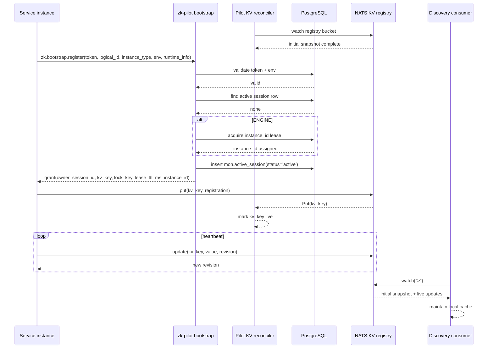
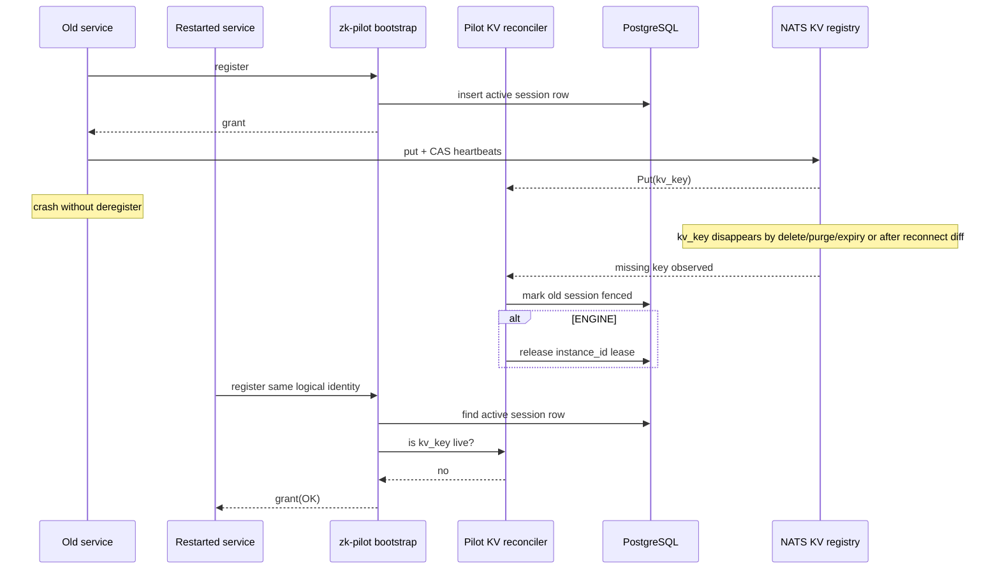
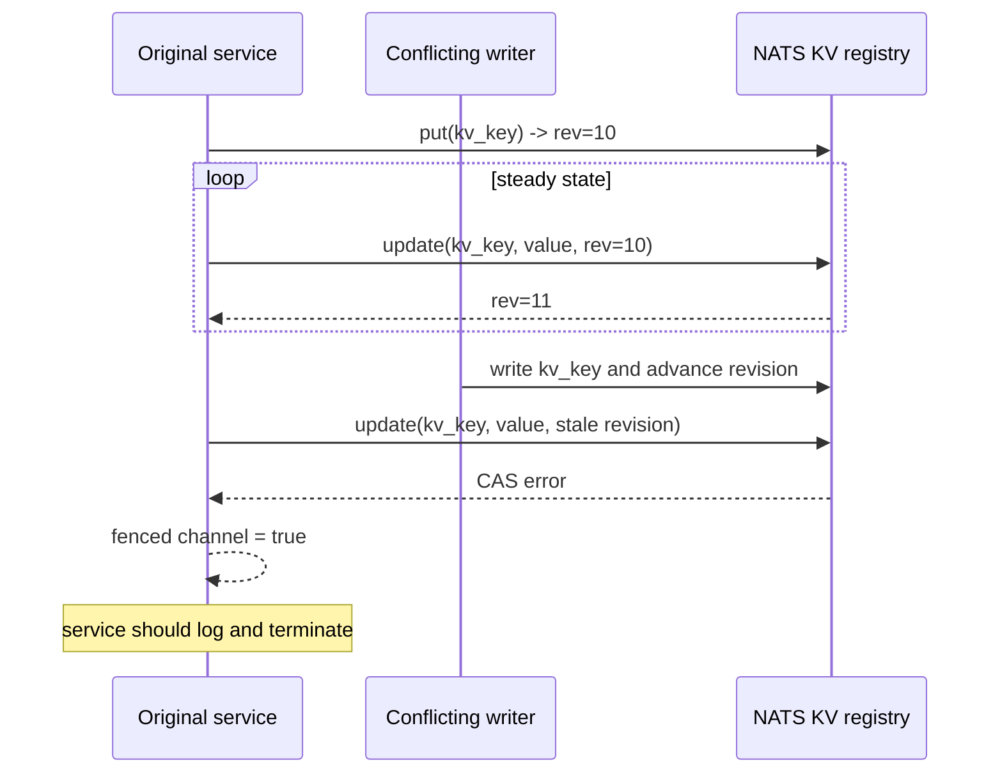
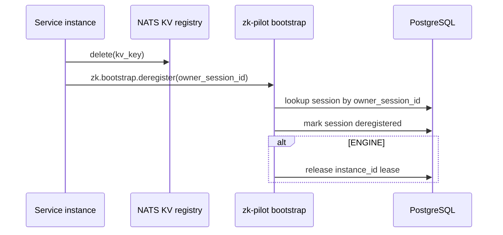
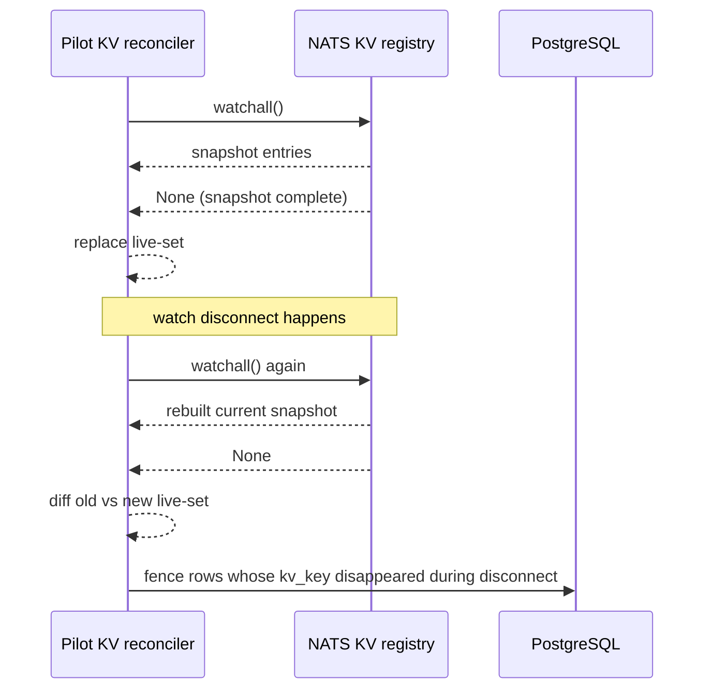

# Service Discovery Mechanism Review

This note documents the service discovery mechanism as currently implemented across:

- `zkbot/services/zk-pilot/src/zk_pilot/bootstrap.py`
- `zkbot/services/zk-pilot/src/zk_pilot/db.py`
- `zkbot/services/zk-pilot/src/zk_pilot/main.py`
- `zkbot/rust/crates/zk-infra-rs/src/nats_kv.rs`
- `zkbot/rust/crates/zk-infra-rs/src/service_registry.rs`
- `zkbot/rust/crates/zk-infra-rs/src/nats_kv_discovery.rs`

It is reviewed against:

- `zkbot/docs/system-arch/topology_registration.md`
- `zkbot/docs/system-redesign-plan/plan/05-registry-and-pilot-bootstrap.md`

## Current Model

The current design is now:

- NATS KV is the runtime liveness source of truth.
- Pilot bootstrap authorizes first registration and allocates metadata.
- `mon.active_session` is a derived control-plane projection, not the liveness authority.
- Pilot runs a KV reconciler to keep DB session state aligned with observed KV state.
- Runtime heartbeats use CAS on `kv_key` to detect conflicting writers.

## Current Components

### 1. Pilot bootstrap handlers

Pilot subscribes to:

- `zk.bootstrap.register`
- `zk.bootstrap.deregister`

`handle_register` currently does:

1. Parse `BootstrapRegisterRequest`.
2. Validate token hash, status, expiry, logical identity, and `env`.
3. Look up any active session row for `(logical_id, instance_type)`.
4. Ask the reconciler whether that session's `kv_key` is still live in KV.
5. If KV says live: reject as `DUPLICATE`.
6. If DB says active but KV says gone: fence the stale row and continue.
7. If engine: allocate `instance_id`.
8. Return `owner_session_id`, `kv_key`, `lock_key`, `lease_ttl_ms`, and optional `instance_id`.

`handle_deregister` currently:

1. Looks up session metadata by `owner_session_id`.
2. Marks the row `deregistered`.
3. Releases engine `instance_id` lease if applicable.

### 2. Pilot KV reconciler

Pilot starts a `KvReconciler` before serving bootstrap requests.

The reconciler:

- watches the registry KV bucket
- keeps an in-memory set of live `kv_key`s
- waits for the initial KV snapshot before bootstrap handlers are enabled
- rebuilds the live set from scratch on reconnect
- fences stale DB sessions when keys disappear or are missing from a rebuilt snapshot

### 3. Runtime registration client

`ServiceRegistration::register_with_pilot`:

1. sends `BootstrapRegisterRequest`
2. receives grant from Pilot
3. writes `kv_key`
4. captures the returned KV revision
5. starts a CAS heartbeat using `update(key, value, revision)`

If CAS fails, the heartbeat task:

- sends `true` on the `fenced` watch channel
- stops heartbeating

The owning service is expected to call `wait_fenced()` and shut down if fencing occurs.

### 4. Discovery client

`KvDiscoveryClient` is still a read-side KV watch cache for consumers.

Its current startup contract is:

- `start()` returns an empty cache
- caller must invoke `spawn_watch_loop()` immediately
- the single watch stream delivers initial snapshot entries before live updates

## Data Model Role Split

The current intended role split is:

- KV bucket: actual runtime liveness and discoverable endpoint state
- `mon.active_session`: current-state projection for Pilot/admin workflows
- `mon.registration_audit`: append-only historical trace

`mon.active_session` should not be treated as the source of truth when KV disagrees.

## Contract Guidance

The registry and discovery layers should stay generic.

Guidelines:

- `service_type` remains a coarse discovery category such as `gw`, `oms`, `engine`, `mdgw`, or `composite`
- business-specific meaning is carried in payload metadata/capabilities and Pilot DB state
- discovery clients expose raw registrations and generic predicates
- higher-level clients such as `TradingClient` or Pilot workflows apply business-specific resolution rules
- singleton policy, composite-role semantics, and strategy ownership should not be encoded into the generic discovery client

## Sequence Diagrams

### 1. Normal bootstrap and steady-state heartbeat

### 2. Restart after crash with KV-based stale-session recovery

### 3. Conflicting writer detected by CAS heartbeat

### 4. Clean deregistration

### 5. Pilot reconciler reconnect rebuild

## What Is Implemented Now

- token validation includes `env`
- clean deregister releases engine lease by looking up session metadata from `owner_session_id`
- active session uniqueness is guarded by DB index
- Pilot pre-creates the registry bucket before waiting on reconciler readiness
- Pilot waits for an initial KV snapshot before serving bootstrap requests
- Pilot duplicate detection is KV-backed, not DB-TTL-backed
- Pilot reconciles stale DB rows from observed KV loss
- runtime heartbeats use CAS on `kv_key`
- runtime exposes a fencing wait API
- consumer discovery uses a single watch stream for snapshot + live updates
- Python unit tests were added for DB helpers, bootstrap handlers, and reconciler logic
- Rust unit tests were added for CAS heartbeat, fence signalling, and discovery cache helpers

## Remaining Review Findings

### 1. `KvDiscoveryClient` now clears its cache before a new watch is established

The reconnect fix in the consumer discovery client clears the in-memory cache before `watch(">")` succeeds. If opening the new watch fails or is delayed, every service temporarily disappears from the client view even though the last known snapshot may still have been valid.

Consequence:

- transient NATS/watch failures can cause a full temporary service blackout on the consumer side
- callers cannot distinguish "discovery reconnecting" from "no services exist"

### 2. CAS fencing is only useful if every owning service actually supervises `wait_fenced()`

The library now exposes `wait_fenced()`, but enforcement still depends on each service integrating it correctly. If a service ignores the fence signal, it can continue serving traffic even after losing discovery ownership.

Consequence:

- split-brain can still exist at the application layer
- discovery correctness improves, but service behavior may still be unsafe

### 3. `lock_key` is still issued but not used

The current system now has CAS on `kv_key`, which is a meaningful improvement. But `lock_key` remains unused, so there is still no separate ownership record or explicit takeover protocol.

Consequence:

- ownership is inferred from write success, not represented explicitly
- controlled takeover remains underspecified

### 4. Python tests are present but are not runnable from the current `uv` environment

The Pilot test suite now exists, but in the current local environment `uv run python -m pytest tests -q` fails because `pytest` is not installed in the service environment.

Consequence:

- the Python unit tests are not yet part of a reproducible local verification path
- CI or local onboarding may miss regressions unless test dependencies are wired in explicitly

## TODO

### High priority

- Fix `KvDiscoveryClient` reconnect behavior so cache replacement happens only after a new snapshot is available, not before `watch(">")` succeeds.
- Integrate `wait_fenced()` into every runtime service supervisor so fencing triggers shutdown or restart.

### Medium priority

- Add `registration_audit` writes for bootstrap accept/reject, deregister, and reconcile-driven fencing events.
- Decide whether KV expiry always produces delete-style watch events; if not, add a periodic Pilot DB-vs-KV sweep as a safety net.
- Decide whether consumers should also enforce payload-level freshness from `lease_expiry_ms` in addition to KV presence.
- Add `pytest` to the `zk-pilot` test environment and wire the Python tests into the normal local/CI verification flow.

### Deferred design work

- Implement separate `lock_key` ownership protocol with CAS.
- Add scoped runtime NATS credentials.
- Enforce topology, binding, tenant, and `cfg.logical_instance.enabled` checks during bootstrap.
- Define controlled takeover semantics.

## Test Plan

The service discovery mechanism now spans:

- Python DB helpers
- Python bootstrap request handlers
- Python Pilot KV reconciler
- Rust KV wrapper and CAS heartbeat
- Rust discovery watch cache

The highest-value coverage is a mix of:

- unit tests for state transitions and handler logic
- integration tests for NATS KV + PostgreSQL behavior

### Current verification status

- `cargo test -p zk-infra-rs` passes for the current Rust unit tests.
- Python unit tests are present under `zkbot/services/zk-pilot/tests/`.
- In the current local environment, `uv run python -m pytest tests -q` fails because `pytest` is not installed in the service environment.

### Unit Test Cases

#### Python: `zk_pilot.db`

Target file:

- `zkbot/services/zk-pilot/src/zk_pilot/db.py`

Recommended cases:

- `validate_token_accepts_matching_env`
  - seed `cfg.logical_instance` and `cfg.instance_token`
  - verify valid token returns `token_jti`

- `validate_token_rejects_wrong_env`
  - same token/logical identity but mismatched `env`
  - expect `None`

- `find_session_for_logical_returns_active_row`
  - insert active and fenced/deregistered rows
  - verify only active row is returned

- `fence_session_marks_row_fenced`
  - insert active row
  - call `fence_session`
  - verify `status='fenced'`

- `deregister_session_marks_row_deregistered`
  - insert active row
  - call `deregister_session`
  - verify `status='deregistered'`

- `acquire_instance_id_allocates_unique_id`
  - call twice for different logical IDs in same env
  - verify distinct IDs

- `release_instance_id_removes_lease`
  - seed lease row
  - call `release_instance_id`
  - verify row deleted

These are best run as DB-backed tests against a temporary PostgreSQL schema rather than heavy mocking.

#### Python: bootstrap handlers

Target file:

- `zkbot/services/zk-pilot/src/zk_pilot/bootstrap.py`

Recommended cases:

- `handle_register_returns_ok_for_valid_request`
  - mock token validation success
  - mock no existing session
  - verify response `status="OK"`

- `handle_register_rejects_duplicate_when_kv_live`
  - mock active DB session
  - mock `reconciler.is_kv_live(...) == True`
  - verify response `status="DUPLICATE"`

- `handle_register_fences_stale_db_session_when_kv_missing`
  - mock active DB session
  - mock `reconciler.is_kv_live(...) == False`
  - verify `db.fence_session(...)` called
  - verify registration proceeds

- `handle_register_rejects_invalid_token`
  - mock `validate_token -> None`
  - verify response `status="TOKEN_EXPIRED"`

- `handle_register_engine_allocates_instance_id`
  - mock engine request and `acquire_instance_id`
  - verify response contains `instance_id`

- `handle_register_engine_rejects_when_no_instance_id_available`
  - mock `acquire_instance_id -> None`
  - verify response `status="NO_INSTANCE_ID_AVAILABLE"`

- `handle_deregister_releases_engine_lease_by_owner_session_id`
  - mock `get_session` returning an engine session
  - verify `release_instance_id(...)` called even though request identity fields are empty

For these tests, mock:

- `Msg.respond`
- DB helper calls
- reconciler methods

#### Python: `KvReconciler`

Target file:

- `zkbot/services/zk-pilot/src/zk_pilot/bootstrap.py`

Recommended cases:

- `reconciler_initial_snapshot_populates_live_set`
  - fake watch yields `PUT(k1)`, `PUT(k2)`, `None`
  - verify `_live == {k1, k2}`
  - verify `_ready` is set

- `reconciler_live_put_adds_key_after_snapshot`
  - snapshot completes
  - then emit `PUT(k3)`
  - verify `k3` added

- `reconciler_live_delete_removes_key_and_fences_session`
  - snapshot contains `k1`
  - later emit `DELETE(k1)`
  - verify `_on_kv_lost(k1)` invoked

- `reconciler_reconnect_rebuilds_live_set`
  - first watch snapshot contains `k1`, `k2`
  - second watch snapshot after reconnect contains only `k2`
  - verify `k1` is removed from `_live`

- `reconciler_reconnect_diff_fences_vanished_keys`
  - same as above
  - verify `_on_kv_lost(k1)` invoked during snapshot diff

These tests are easiest if the watcher is represented by a fake async iterator with scripted events.

#### Rust: `KvRegistryClient` CAS heartbeat

Target files:

- `zkbot/rust/crates/zk-infra-rs/src/nats_kv.rs`
- `zkbot/rust/crates/zk-infra-rs/src/service_registry.rs`

Recommended cases:

- `heartbeat_loop_advances_revision_on_success`
  - fake KV store returns successive revisions
  - verify loop keeps running and revision updates

- `heartbeat_loop_sends_fenced_signal_on_cas_conflict`
  - fake KV store returns error from `update`
  - verify `watch::Receiver<bool>` observes `true`

- `wait_fenced_returns_when_signal_is_sent`
  - construct `ServiceRegistration`-equivalent receiver path
  - verify `wait_fenced()` completes

- `register_with_pilot_maps_non_ok_response_to_registration_error`
  - decode a failing Pilot response
  - verify `RegistrationError::Pilot`

These are easiest if the KV update path is abstracted behind a trait or a small fakeable wrapper.

#### Rust: `KvDiscoveryClient`

Target file:

- `zkbot/rust/crates/zk-infra-rs/src/nats_kv_discovery.rs`

Recommended cases:

- `discovery_watch_put_populates_cache`
  - emit `Put` with valid payload
  - verify `snapshot()` contains entry

- `discovery_watch_delete_removes_cache_entry`
  - emit `Put` then `Delete`
  - verify entry removed

- `discovery_watch_skips_malformed_payload`
  - emit invalid bytes
  - verify cache unchanged

- `discovery_resolve_filters_entries`
  - seed cache with multiple services
  - verify `resolve(...)` returns matching subset

- `discovery_reconnect_rebuild_removes_vanished_keys`
  - add once reconnect-rebuild logic exists
  - verify stale entries do not survive disconnect gaps

### Integration Test Cases

These are the most useful end-to-end checks because correctness depends on JetStream KV and PostgreSQL interaction.

#### Bootstrap + KV + PostgreSQL

- `test_bootstrap_register_success_roundtrip`
  - start Pilot with Postgres + NATS
  - send `zk.bootstrap.register` with valid token
  - assert response `status="OK"`
  - assert `mon.active_session` row created

- `test_bootstrap_duplicate_when_existing_kv_key_live`
  - create active session row and live KV key
  - send second register
  - assert `status="DUPLICATE"`

- `test_bootstrap_allows_restart_after_kv_loss`
  - register once
  - remove or expire KV key
  - wait for reconciler
  - register again
  - assert stale row fenced and new registration succeeds

- `test_bootstrap_deregister_releases_engine_lease`
  - register engine
  - call deregister with only `owner_session_id`
  - assert `cfg.instance_id_lease` row removed

- `test_bootstrap_env_mismatch_rejected`
  - use valid token with wrong env
  - assert `TOKEN_EXPIRED`

#### Runtime CAS behavior

- `test_register_with_pilot_starts_cas_heartbeat`
  - register service through Pilot
  - inspect KV revisions across heartbeats
  - verify revisions advance via CAS updates

- `test_cas_conflict_fences_runtime`
  - register service
  - externally overwrite same `kv_key`
  - assert heartbeat stops and `wait_fenced()` completes

#### Consumer discovery behavior

- `test_discovery_client_sees_initial_snapshot_and_live_updates`
  - start discovery client and watch loop
  - write KV key
  - assert client resolves it
  - delete KV key
  - assert client removes it

- `test_pilot_reconciler_and_consumer_discovery_stay_consistent`
  - register service
  - confirm Pilot reconciler marks key live
  - confirm consumer discovery sees same key
  - delete/expire key
  - confirm both clear it

### Suggested Priority

If coverage needs to be added incrementally, start with:

1. `handle_register_rejects_duplicate_when_kv_live`
2. `handle_register_fences_stale_db_session_when_kv_missing`
3. `reconciler_reconnect_diff_fences_vanished_keys`
4. `heartbeat_loop_sends_fenced_signal_on_cas_conflict`
5. `test_bootstrap_allows_restart_after_kv_loss`
6. `test_cas_conflict_fences_runtime`
