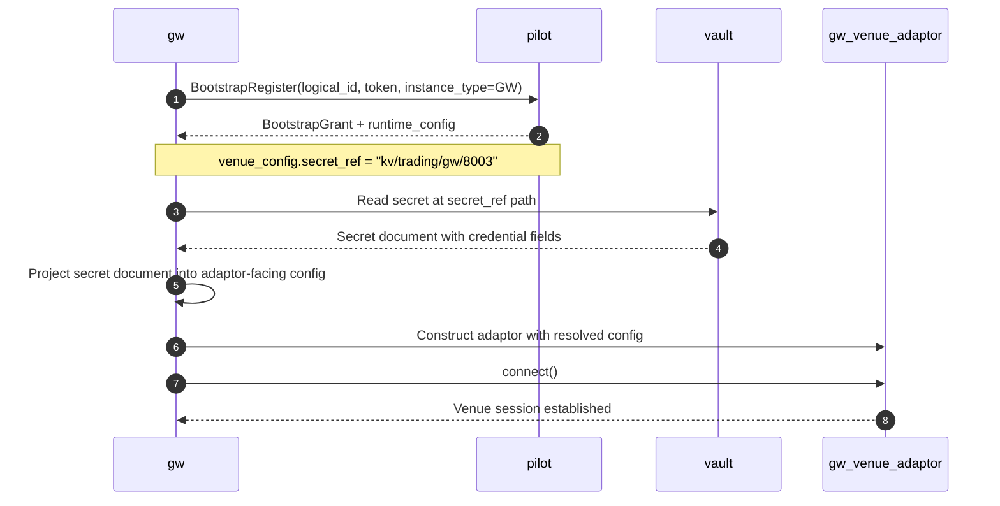

# Gateway Service

## Scope

`zk-gw-svc` is the trading gateway service for one venue/account runtime scope.

## Design Role

The trading gateway wraps venue order and account APIs and exposes a stable internal gRPC contract.

Responsibilities:

- place and cancel orders
- query balances, orders, trades, and account settings
- publish normalized gateway events to NATS
- register a live endpoint in KV

Gateway command ACK semantics should be queue-based:

- success means the gateway validated the request and accepted it for asynchronous processing
- success does not mean the request was already enqueued to a worker, sent to the venue, or accepted by the venue
- internal dispatch drops, queue issues, or venue send failure after ACK must be surfaced asynchronously through gateway events
  or explicit failure callbacks to OMS

The gateway should follow similar control constraints to the RTMD gateway:

- Pilot/bootstrap is used for startup authorization and topology truth
- steady-state trading and publishing must not depend on Pilot being in the request path
- venue-specific runtime behavior is implemented through adaptors

Design constraint:

- the gateway should remain operationally simple and as stateless as possible
- limited internal state is acceptable for transport/session handling, rate limiting, reconnect,
  trust-window buffering, and published-position tracking
- durable command idempotency and durable deduplication should not live in the gateway
- if stronger deduplication is required, OMS should own it

## Adaptor Model

The gateway runtime should be adaptor-driven so venue specifics remain isolated.

The venue adaptor should be resolved through the shared venue-integration mechanism described in
[Venue Integration Modules](/Users/zzk/workspace/zklab/zkbot/docs/system-arch/venue_integration.md).

The adaptor boundary should stay minimal.

Suggested adaptor responsibilities:

- translate gateway commands into venue requests
- translate gateway queries into venue queries
- manage venue connectivity/session state
- surface normalized venue facts into the gateway service layer
- handle venue-specific rate limits and transport quirks

The adaptor should not own the cross-event semantic contract.

Specifically, the adaptor should not decide:

- trade exactly-once behavior
- order at-least-once publication behavior
- balance/position causality semantics
- cross-event ordering guarantees between order, trade, balance, and position outputs

Those semantics belong in the gateway service layer.

Non-goals for the gateway:

- command idempotency enforcement
- durable event deduplication
- long-lived account/order state authority
- cross-service recovery orchestration

### Minimal Adaptor API

The adaptor API should be narrow and fact-oriented.

Recommended Rust shape:

```rust
#[async_trait]
pub trait VenueAdapter: Send + Sync {
    async fn connect(&self) -> Result<()>;

    async fn place_order(&self, req: VenuePlaceOrder) -> Result<VenueCommandAck>;
    async fn cancel_order(&self, req: VenueCancelOrder) -> Result<VenueCommandAck>;

    async fn query_balance(&self, req: VenueBalanceQuery) -> Result<Vec<VenueBalanceFact>>;
    async fn query_order(&self, req: VenueOrderQuery) -> Result<Vec<VenueOrderFact>>;
    async fn query_open_orders(&self, req: VenueOpenOrdersQuery) -> Result<Vec<VenueOrderFact>>;
    async fn query_trades(&self, req: VenueTradeQuery) -> Result<Vec<VenueTradeFact>>;
    async fn query_funding_fees(
        &self,
        req: VenueFundingFeeQuery,
    ) -> Result<Vec<VenueFundingFeeFact>>;
    async fn query_positions(&self, req: VenuePositionQuery) -> Result<Vec<VenuePositionFact>>;

    async fn next_event(&self) -> Result<VenueEvent>;
}

pub enum VenueEvent {
    Order(VenueOrderFact),
    Trade(VenueTradeFact),
    Balance(VenueBalanceFact),
    Position(VenuePositionFact),
    System(VenueSystemEvent),
}
```

Design intent:

- request types above are adaptor-facing, not gRPC-facing
- fact types above are venue-normalized but still pre-semantic-unification
- `next_event()` may be backed by WebSocket callbacks, polling loops, or simulator hooks
- a Python adaptor can expose the same shape through async iterator / callback wrappers

The reference Python simulator and CCXT-style publishers suggest two useful boundaries:

- command/query entrypoints stay simple and synchronous-from-the-caller-perspective
- venue streaming is delivered as facts/events, not as final gateway publication objects

### Adaptor Operating Modes

The adaptor API must support both event-driven and query-driven venues behind the same gateway
service contract.

Supported adaptor modes:
- `streaming`
  - adaptor receives venue events from WebSocket or equivalent push feeds
  - `next_event()` yields venue facts derived from the live stream
- `query_after_action`
  - adaptor issues compensating queries immediately after local actions such as place/cancel
  - used when a venue has no reliable event stream for orders/trades
- `periodic_query`
  - adaptor periodically queries orders/trades/balance/position and synthesizes `VenueEvent` facts
  - used to simulate a live event stream when venue push delivery is missing or unreliable
- `hybrid`
  - adaptor uses venue streaming when available, but still performs query-after-action and periodic
    polling as a recovery/safety path

These should be treated as feature flags/capabilities rather than mutually exclusive identities.
In practice, most real gateways will run in a hybrid combination chosen by gateway-owned policy.

Important rule:

- query-driven synthesis is not only for venues without streaming
- even when streaming exists, the adaptor may use query-after-action and periodic-query as a
  correctness backstop

Recommended behavior by mode:

- after `place_order` / `cancel_order`, adaptor may immediately query order state and recent trades
  to synthesize follow-up facts
- periodic polling should query:
  - open/recent orders, including a dedicated startup/reconnect open-orders resync path
  - recent trades/fills
  - optional funding-fee / financing-charge history where the venue exposes it
  - balance snapshots
  - position snapshots
- polling deltas should be converted into `VenueEvent` facts, not published directly

This keeps all venues on one gateway-owned semantic pipeline regardless of how raw venue state is obtained.

## Internal Execution Model

The gateway service should separate ingress ACK from venue I/O completion.

Recommended flow:

1. validate the inbound gRPC request
2. accept it for asynchronous processing
3. reply success
4. let worker tasks perform actual venue dispatch and follow-up queries/events

Recommended properties:

- internal queue is bounded
- worker concurrency is configurable
- per-order ordering is preserved by routing place/cancel for the same `order_id` to the same
  internal shard when the venue semantics allow it

This contract allows OMS to use async-processing ACK semantics end-to-end instead of blocking on
venue round-trip time.

### Gateway-Owned Semantic Pipeline

The gateway service should consume `VenueEvent` facts and run them through one internal
normalization pipeline:

1. ingest venue fact
2. correlate with known order/account state
3. derive canonical order/trade/balance/position changes
4. enforce publication guarantees
5. publish normalized gateway events

This keeps venue adaptors small while centralizing the hard correctness rules.

Important boundary:

- the gateway may normalize and correlate enough to produce a clean event stream
- but durable exactly-once and durable dedup state that spans reconnects or restarts should be
  handled by OMS, not by the gateway

## Order Identity Linkage

`client_order_id` is generated upstream, typically by the distributed trading SDK.

The gateway should not generate the client order identity, but it must ensure there is at least one
observable linkage between:

- `client_order_id`
- venue-native order id

Recommended rule:

- the first gateway-visible order event or command acknowledgment that learns the venue-native order
  id should include both identifiers
- subsequent events may include one or both identifiers, but at least one early linkage event must
  exist so OMS can build and persist the mapping

OMS note:

- OMS should treat this linkage event as the durable correlation point between upstream and
  venue-native order identity

### Streaming Trust Window And Compensating Queries

Even in `streaming` mode, a pushed balance or position update may arrive too early or too close to a
recent order/trade/cancel transition to be trusted as a complete state update.

Design rule:

- if a balance/position update arrives before, or only slightly after, a recent order/trade/cancel
  event affecting the same account/instrument scope, the gateway should treat that update as
  potentially incomplete
- in that case the gateway should trigger a compensating snapshot query before publishing the
  authoritative downstream balance/position state

Recommended mechanism:

- maintain a short gateway-owned trust window after relevant order/trade/cancel transitions
- within that window:
  - raw streaming balance/position facts may be buffered or marked tentative
  - `query_balance` / `query_positions` may be triggered to confirm the new state
- publish downstream balance/position updates only when the gateway has a trustworthy view

This rule applies even when venue streaming exists, because many venues do not guarantee strict
causal ordering between order/trade events and account-state pushes.

### Explicit `-> 0` Position Transition

Some venues do not push a position update when a position goes to zero. The gateway service must
still publish that transition explicitly.

Design choice:

- maintain a gateway-owned published-position set keyed by:
  - account
  - instrument
  - side or position dimension required by the product type

Rules:

- when a position is observed and published as non-zero, its key enters the published-position set
- if later facts or compensating queries indicate the position is now absent or zero, the gateway
  must emit an explicit zero-position publication
- after the zero-position publication is emitted, the key is removed from the published-position set

Sources that can trigger the zero transition:

- streaming position fact with explicit zero quantity
- compensating `query_positions` result where the previously published key is absent
- post-trade or post-cancel recovery query showing the position closed

This mechanism should apply to:

- derivatives positions
- spot inventory-style position views when those are modeled as position events

The adaptor should only surface venue facts. The decision to synthesize and publish an explicit
`-> 0` transition belongs in the gateway service layer.

## Unified Reconnect Model

Gateway reconnect handling should be implemented once in the gateway service layer, not reinvented
per adaptor.

Recommended gateway state machine:

- `STARTING`
- `CONNECTING`
- `LIVE`
- `DEGRADED`
- `RESYNCING`
- `STOPPING`

Unified reconnect flow:

1. adaptor connection drops or a fatal venue-stream error is observed
2. gateway marks itself `DEGRADED`
3. gateway stops trusting incremental venue stream continuity
4. gateway reconnect supervisor runs bounded backoff/jitter retry
5. adaptor re-establishes transport/session
6. gateway chooses recovery path:
   - resume streaming if trustworthy
   - or switch to query-driven recovery mode
7. gateway emits `GW_EVENT_STARTED` or a dedicated reconnect/resync system event
8. gateway runs compensating snapshot queries for balance and position
9. gateway re-enters `LIVE`

Design rule:

- incremental venue events alone are not trusted after reconnect
- compensating snapshot queries are required to restore balance/position correctness

Adaptor role during reconnect:

- report transport/session loss
- re-establish venue connectivity
- surface post-reconnect venue facts
- if needed, fall back to query-driven event synthesis until streaming is trustworthy again

Gateway service role during reconnect:

- own retry/backoff policy
- own state transitions
- own system-event publication
- own compensating resync workflow
- own publication ordering during recovery
- own the decision to treat adaptor output as streaming-backed or query-synthesized

Lifecycle/system events should be emitted for important state transitions such as:

- `STARTING`
- `LIVE`
- `DEGRADED`
- `RESYNCING`
- `STOPPING`

TODO:

- define the exact gateway lifecycle event schema and topic naming
- define which lifecycle transitions should trigger OMS-side bounded resync

## Compensating Snapshot Queries

Balance and position state require compensating snapshot queries after reconnect and at selected
recovery boundaries.

Required cases:

- gateway startup
- gateway reconnect after venue stream loss
- OMS-triggered explicit resync
- suspected stream gap or sequence discontinuity

Required query families:

- `query_balance`
- `query_positions`

Recommended rule:

- after reconnect, publish fresh balance/position state only from compensating query output until
  the gateway has re-established a trustworthy live stream baseline
- use the same compensating query path when streaming balance/position updates fall inside the
  trust window after recent order/trade/cancel transitions

This prevents downstream OMS/account state from drifting when a venue stream silently drops state.

OMS note:

- gateway compensating queries should stay local to the gateway implementation
- OMS remains responsible for deciding when a broader account/order reconciliation cycle is needed

## Gateway Config Model

Gateway configuration should be split into:

- minimal deployment config
- effective enriched runtime config

### Minimal Deployment Config

The deployment config should be intentionally small. It exists only to let the process find Pilot,
authenticate, and bootstrap.

Recommended deployment config:

- `env`
- Pilot/NATS endpoint bootstrap info
- Vault endpoint/auth method bootstrap info
- workload identity or auth mount metadata
- stable local runtime identity input such as `logical_id` or bootstrap token path
- optional local dev overrides

The deployment config should not contain:

- full gateway business config
- venue API secrets
- duplicated operator-managed topology settings
- long-lived copies of adaptor-specific runtime configuration

### Effective Enriched Runtime Config

After bootstrap, the gateway should operate from a Pilot-provided effective config assembled from
control-plane state.

The effective config should contain:

- `gw_id`
- `venue`
- `account_id`
- `enabled` 
- gRPC bind/advertise settings
- NATS / registration settings
- reconnect policy
- publication capability metadata
- secret reference metadata

It should also contain adaptor-specific runtime config.

Manifest/config rule:

- the adaptor-specific desired config should be validated by Pilot against the venue manifest's
  `gw_config.schema.json`
- the manifest should also classify reloadable vs restart-required fields for the gateway runtime
- Pilot remains the source of truth for desired config; the gateway applies the effective config it
  was given at bootstrap or reload time

Adaptor-specific runtime config covers:

- venue REST/WS endpoints
- broker/account-type specific options
- symbol or product-family options
- adaptor rate-limit knobs
- adaptor feature flags
- any venue-specific request formatting options

Recommended loading rule:

- gateway starts with minimal deployment config only
- gateway bootstraps with Pilot and receives the effective enriched config
- gateway validates required generic fields
- adaptor receives a typed adaptor-specific config blob from the enriched config
- reconnect policy stays generic unless a venue requires additive overrides

## Bootstrap, Config, And Secret Retrieval

Gateway bootstrap should separate:

- identity and topology authorization
- runtime config retrieval
- secret retrieval

This follows the shared bootstrap decision in
[Bootstrap And Runtime Config](/Users/zzk/workspace/zklab/zkbot/docs/system-arch/bootstrap_and_runtime_config.md).

### Secret Retrieval

Trading secrets should remain in Vault and should not be proxied through Pilot.

Recommended flow:

1. gateway bootstraps with Pilot using token-based registration
2. Pilot returns or authorizes:
   - logical identity
   - effective enriched runtime config
   - `secret_ref` metadata only, where `secret_ref` is the Vault path reference
3. gateway authenticates to Vault using deployment identity
   - Kubernetes service account
   - AppRole
   - or another deployment-native auth mechanism
4. gateway reads the Vault secret document directly from Vault via `secret_ref`
5. gateway projects that document into adaptor-facing config fields
   - example: `apikey -> token`
   - example: `apikey/secretkey/passphrase -> api_key/secret_key/passphrase`
6. adaptor uses those credentials to establish the venue session

Design rules:

- Pilot manages references and policy, not raw trading secrets
- Vault remains the source of truth for secrets
- gateway runtime is the component that actually fetches secrets
- shared infra/Vault code should not hardcode venue-specific field mappings
- venue adaptors should consume resolved credentials rather than owning Vault client logic

Reference sequence:



### Config Management

Production recommendation:

- minimal deployment config is owned by deployment tooling
- effective enriched runtime config is managed by Pilot/control-plane data in PostgreSQL
- `cfg.gateway_instance` holds the generic and adaptor-specific runtime config
- Pilot is the authoring/update path for operators

Development recommendation:

- devops scripts may seed runtime config into the same Pilot-managed tables
- simple env/file overrides are acceptable for local development only
- avoid a separate long-term config system for dev vs prod

Preferred model:

- one canonical runtime config schema in Pilot-managed tables
- one small deployment bootstrap config per deployment target
- prod: operator edits through Pilot/UI/API
- dev: bootstrap or seed scripts populate that same schema

This keeps the runtime path consistent while still allowing lightweight developer setup.

### Runtime Config Introspection

The gateway should expose a default `GetCurrentConfig` style query.

Purpose:

- let Pilot retrieve the currently loaded effective gateway config
- compare desired config in Pilot against the live effective config
- surface operator-visible drift
- support reload vs restart decisions

Response guidance:

- return normalized effective config plus metadata such as `loaded_at`, config revision, and
  optional config hash
- return secret references if needed, but never raw secret material

## Registration

Trading gateways register under `svc.gw.<gw_id>`.

The registration payload remains generic and carries:

- `service_type = "gw"`
- transport endpoint
- venue
- account scope
- capabilities
- publication/delivery capability metadata where needed

Consumers should be able to discover:

- the gRPC endpoint
- what command/query families the gateway supports
- any important publish-contract features such as trade-exactly-once support

Recommended capability metadata also includes:

- `supports_streaming_order_events`
- `supports_streaming_trade_events`
- `supports_streaming_balance_events`
- `supports_streaming_position_events`
- `supports_balance_query`
- `supports_position_query`
- `supports_trade_history_query`
- `supports_query_after_action`
- `supports_periodic_query`
- `supports_trade_exactly_once_contract`
- `supports_order_at_least_once_contract`

## Event Publishing Semantics

Gateway event semantics need to be unified across order, trade, position, and balance publication.

Required contract:

- trade/fill events: exactly once
- order lifecycle events: at least once
- balance/position publications: causal with respect to the order/trade updates they follow

Implication:

- if a balance or position update is published after an order/trade event, that balance/position must
  already reflect the effect of that event

Recommended model:

- normalize one internal state transition pipeline per venue event
- derive order, trade, balance, and position publications from the same transition result
- carry stable identifiers for fills/trades so downstream consumers can enforce exactly-once behavior
- keep adaptor output minimal and venue-fact oriented; let the gateway service own semantic unification

Delivery mechanism guidance:

- prefer NATS subject and stream choices to enforce the intended delivery semantics
- keep gateway-side publication logic simple
- avoid embedding complex durable message-processing logic in the gateway only to emulate semantics
  that should be handled by transport choice plus OMS reconciliation

OMS note:

- if downstream deduplication is needed beyond the transport guarantees, OMS should own it

## Deferred Work

- OMS-side command idempotency and retry policy
- OMS-side durable deduplication policy for gateway-originated events
- explicit lifecycle event schema and handling policy
- fuller gateway/account recovery contract between OMS and gateway
- dedicated error classification and handling document

The current wire contract may still use the existing gateway topics, but the semantic rules must be
uniform regardless of whether a venue natively emits separate order and trade feeds.

## Simulator Requirement

The gateway design should include a dedicated simulator/test-harness runtime, not just venue
adaptors.

The simulator should:

- implement the same GatewayService contract
- exercise the same publication semantics as the real gateway
- support configurable fill/match behavior
- serve as the integration harness for OMS and engine testing

See [Gateway Simulator](/Users/zzk/workspace/zklab/zkbot/docs/system-arch/services/gateway_simulator.md).

## Related Docs

- [API Contracts](/Users/zzk/workspace/zklab/zkbot/docs/system-arch/api_contracts.md)
- [Service Discovery](/Users/zzk/workspace/zklab/zkbot/docs/system-arch/service_discovery.md)
- [Pilot Service](/Users/zzk/workspace/zklab/zkbot/docs/system-arch/services/pilot_service.md)
- [Gateway Simulator](/Users/zzk/workspace/zklab/zkbot/docs/system-arch/services/gateway_simulator.md)
- [Error Handling](/Users/zzk/workspace/zklab/zkbot/docs/system-arch/error_handling.md)
