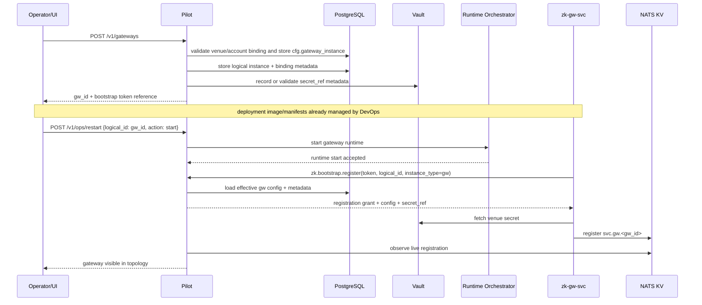
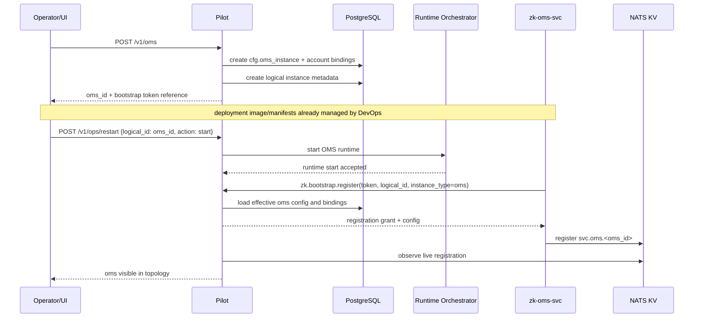
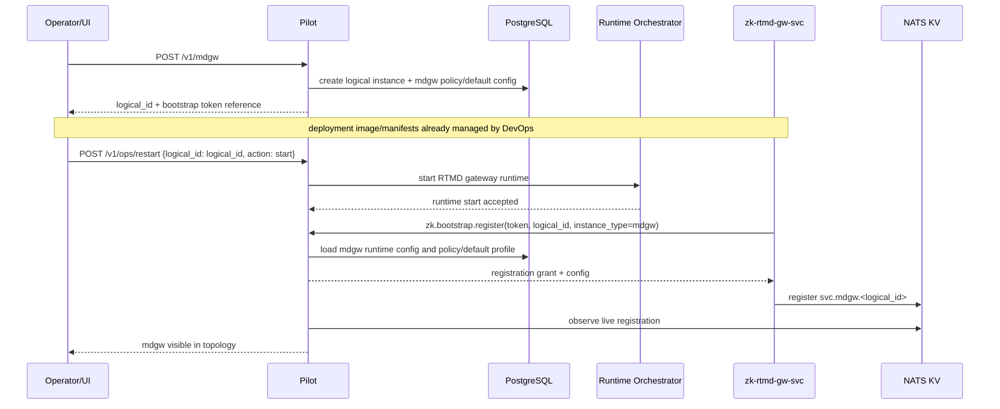
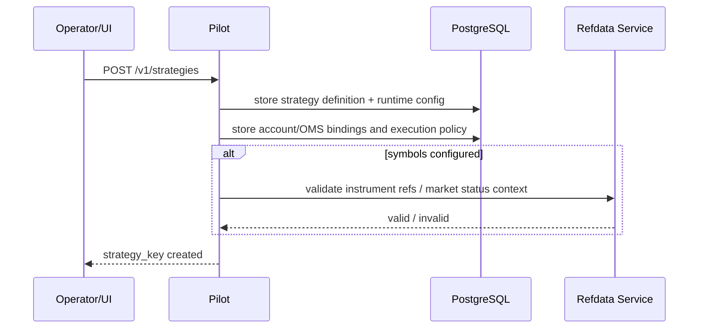
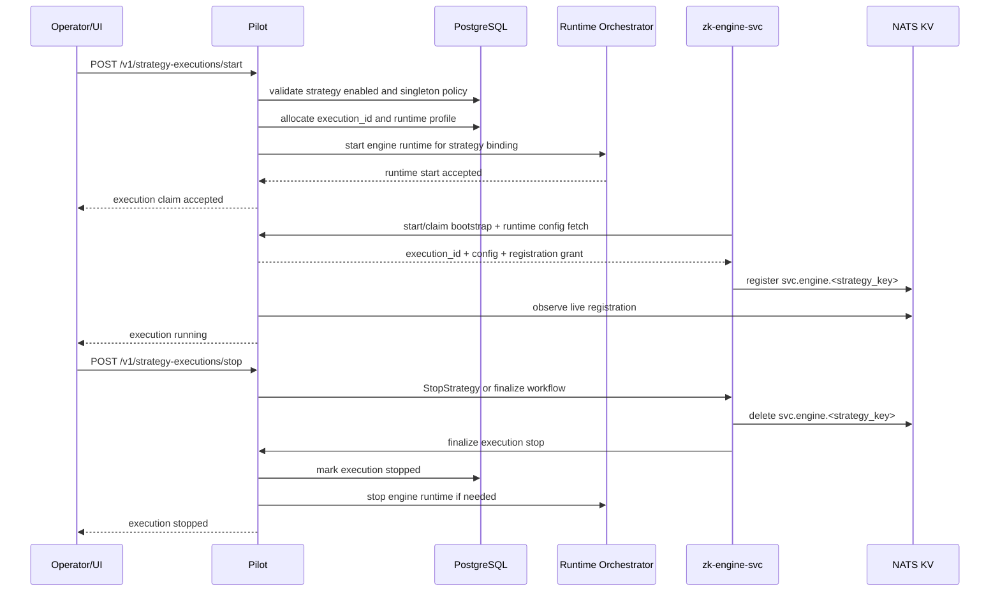
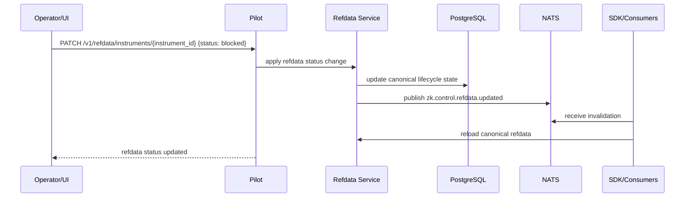

# Pilot Service

## Scope

`zk-pilot` is the control-plane service for topology, bootstrap authorization, runtime claims,
and dynamic configuration.

It owns:

- bootstrap registration and deregistration over NATS request/reply
- control-plane metadata in PostgreSQL
- RTMD policy/default state and RTMD subscription observability
- topology reconciliation from NATS KV
- operator-facing REST control/query APIs

Pilot should also be the admin and trade-facing UI backend for the system.

That means it is the primary control-plane surface for:

- manual trading and trade operations
- account views
- bot and strategy lifecycle management
- trading topology and configuration management
- refdata management
- risk configuration and monitoring views
- general trading operations workflows

## Design Role

Pilot is not on the steady-state data path for normal trading or RTMD publishing.

Pilot is authoritative for:

- whether a logical instance may start
- what runtime metadata/profile a service receives
- singleton policy for strategies and other logical instances
- RTMD policy/defaults and global RTMD topology visibility
- control-plane aggregation for account, bot, refdata, and operations views

Pilot is not the liveness source of truth. Runtime liveness comes from KV registry state and is
reconciled back into Pilot state.

Pilot should also not be the steady-state hub or single forwarding point for RTMD subscription
changes while the system is running.

Pilot should also not become the hot-path execution or market-data transport layer. Its role is to
coordinate, aggregate, inspect, and initiate operations, not to sit in the middle of normal trading
message flow.

## Auth And Environment Notes

Pilot should use:

- external OIDC for authentication
- Pilot-local RBAC for authorization

See [Auth And Authorization](/Users/zzk/workspace/zklab/zkbot/docs/system-arch/auth.md).

Environment model:

- `env` is a property of the deployed Pilot instance
- typical deployment shape is one Pilot per environment such as `test` and `prod`

## Implementation Language Note

Pilot is no longer a small helper process. The target scope is trending toward:

- control-plane API hub
- auth/RBAC boundary
- topology and config service
- runtime-orchestrator client
- aggregation backend for admin and operator views
- later async jobs and possible live UI push

That profile fits a heavier service implementation better than a lightweight scripting-oriented
service.

Recommended direction:

- use Java for Pilot if that matches the team's stronger implementation language

Why Java is a good fit:

- strong support for larger REST backends and layered service design
- mature ecosystem for OIDC, RBAC, DB migrations, typed APIs, schedulers, and admin workflows
- a good fit for DTO-heavy control-plane logic and long-lived backend maintenance
- better team velocity if Java is already the stronger language

Go would also be a reasonable choice:

- simpler runtime and deployment footprint
- strong for infra and control-plane services
- good concurrency model for background jobs

But the main priority should be:

- developer fluency first
- boring operability second
- language consistency last

A sane stack split is:

- Rust for hot-path and systems-facing runtime components
- Python for integration scripts and refdata loaders
- Java for the heavier Pilot control plane

Implementation note:

- keep bootstrap and service-discovery contracts language-agnostic
- keep PostgreSQL schema as the shared control-plane boundary
- keep runtime truth in KV/NATS independent of Pilot implementation language

Caution:

- moving Pilot to Java should not move runtime business truth into Pilot
- KV remains the liveness truth
- refdata service remains the refdata truth
- OMS remains the trading-state authority
- Pilot remains the control plane

## Target Product Scope

Pilot should grow into the unified backend for operator UI, admin workflows, and ad hoc trade
operations.

Target scope:

### 1. Manual trading

- submit manual order/cancel requests through OMS-facing control APIs
- inspect order and trade status
- support operator-initiated panic/kill-switch actions

Design note:

- Pilot initiates or routes the operation through OMS/gateway control surfaces
- Pilot should not become a second independent order-state authority

### 2. Account views

- aggregated account balances
- positions
- open orders
- recent fills/trades

Design note:

- Pilot is an aggregator/query surface
- canonical live trading state remains in OMS/gateway/refdata-backed sources

### 3. Bot and strategy management

- strategy definition/config management
- execution start/stop/restart workflows
- current runtime state and topology visibility
- execution history and logs navigation

### 4. Trading topology and config management

- logical instance definitions
- account/OMS/gateway bindings
- venue module enablement
- RTMD policy/defaults
- service-level runtime config authoring

### 5. Refdata management

- browse/query refdata
- trigger refresh/reload workflows
- inspect refdata lifecycle state
- inspect market session/calendar state for TradFi venues

### 6. Risk control config and monitoring

- manage account/risk config
- inspect monitor/risk alerts
- expose operator-visible risk state summaries
- initiate panic/disable workflows where authorized

### 7. Other trading ops workflows

- topology inspection
- service/session inspection
- reconciliation/audit views
- operational reloads and bounded recovery workflows

## Legacy Mapping Notes

The legacy `zkbot/services/zk-service/src` codebase spreads these concerns across multiple ad hoc
services and APIs:

- `tq_service_api/api_service_strat.py`
  - strategy CRUD
  - execution start/stop
  - strategy log/order query
- `tq_service_api/api_service_instrument_refdata.py`
  - refdata browsing APIs
- `tq_service_app/tq_app.py`
  - account-style views
  - manual trading helpers through `TQClient`
  - followed-order workflows and app-facing API glue
- `tq_service_oms/ods_server.py`
  - account config lookup
  - refdata query
  - account summary/query helpers
  - route/config lookup
- `tq_service_riskmonitor/*`
  - rule-specific monitoring and alerting helpers

Pilot should absorb the control-plane and UI-backend responsibilities from those legacy pieces, but
not their old coupling patterns:

- no ODS-style startup dependency
- no Mongo-first control-plane config model
- no static subject registry as the primary topology mechanism
- no requirement that Pilot sit on the steady-state trading path

## Bounded Responsibilities

Pilot should own:

- control-plane APIs
- aggregation/query composition for the UI/backend
- lifecycle orchestration
- config and topology authoring
- bootstrap authorization
- policy/default state

Pilot should not own:

- canonical hot-path OMS mutation state
- gateway semantic unification
- RTMD hot-path subscription mediation
- refdata cache ownership inside clients
- long-lived exchange connectivity sessions
- deployment rollout as a primary responsibility of the control plane

## Runtime Orchestrator Adaptor

Pilot may use a backend runtime-orchestrator adaptor for bounded runtime operations such as:

- start
- stop
- restart

Examples:

- Kubernetes / k3s API adaptor
- Docker Engine API adaptor

Important boundary:

- this adaptor is for runtime operations only
- deployment and rollout should still go through the normal DevOps process
- Pilot should not become the primary deployment system for building, packaging, or releasing
  service workloads

Recommended split:

- DevOps owns:
  - image build/publish
  - deployment manifests
  - cluster rollout and release process
- Pilot owns:
  - start/stop/restart requests within an already deployed runtime environment
  - control-plane visibility of runtime status
  - coordination with bootstrap/topology state

Config/restart rule:

- config changes are written to DB-backed control-plane state
- running services may detect drift between in-memory runtime config and DB desired state
- the operator decides when to issue reload or restart
- config management and restart operations should remain separate concerns

## Key Interfaces

- Bootstrap NATS subjects:
  - `zk.bootstrap.register`
  - `zk.bootstrap.deregister`
  - `zk.bootstrap.reissue`
  - `zk.bootstrap.sessions.query`
- REST:
  - manual trading and panic actions
  - account views
  - strategy execution start/stop/restart
  - OMS and service reload workflows
  - RTMD subscription policy CRUD and reload
  - topology, refdata, and risk-management queries

The REST surface is the primary Pilot API for UI/backend and ops workflows.

## API Domains

Suggested Pilot REST APIs should be grouped by domain/role.

### 1. Trading

- `POST /v1/manual/orders`
  - submit one manual order through the OMS-facing control path
- `POST /v1/manual/orders:batch`
  - submit multiple manual orders in one operator action
- `POST /v1/manual/cancels`
  - submit one or more manual cancel requests
- `POST /v1/manual/panic`
  - trigger operator panic/kill-switch for a scoped account or OMS
- `POST /v1/manual/panic/clear`
  - clear a previously asserted panic state where policy allows
- `GET /v1/manual/orders/{order_id}`
  - inspect manual-order status and downstream execution state
- `GET /v1/manual/trades`
  - inspect recent manual-trading fills and execution results
- `GET /v1/accounts`
  - list accounts visible to the operator or UI
- `GET /v1/accounts/{account_id}`
  - fetch summary view for one trading account
- `GET /v1/accounts/{account_id}/balances`
  - fetch current balance view for one account
- `GET /v1/accounts/{account_id}/positions`
  - fetch current positions for one account
- `GET /v1/accounts/{account_id}/orders/open`
  - fetch current open orders for one account
- `GET /v1/accounts/{account_id}/trades`
  - fetch recent trades/fills for one account

### 2. System Topology / System Ops

- `GET /v1/topology`
  - return current system topology view across services and bindings
- `PUT /v1/topology/bindings`
  - create or update logical topology bindings
- `GET /v1/topology/services`
  - list service instances and current control-plane metadata
- `GET /v1/topology/sessions`
  - list active bootstrap/runtime sessions known to Pilot
- `POST /v1/services/{logical_id}/issue-bootstrap-token`
  - issue or rotate bootstrap token material for one logical service
- `POST /v1/services/{logical_id}/reload`
  - request a config reload for one logical service
- `POST /v1/ops/reload`
  - request a broader reload workflow for a selected system scope
- `POST /v1/ops/restart`
  - request a bounded restart workflow for a selected runtime scope

Design note:

- UI commands to runtime backends should go through the runtime-orchestrator adaptor
- KV/discovery state remains the runtime truth for live-service presence

### 3. Bot

- `POST /v1/strategies`
  - create a strategy definition and its baseline runtime config
- `PUT /v1/strategies/{strategy_key}`
  - update strategy config or metadata
- `GET /v1/strategies`
  - list strategy definitions
- `GET /v1/strategies/{strategy_key}`
  - fetch one strategy definition and current status summary
- `POST /v1/strategies/{strategy_key}/validate`
  - validate strategy config, bindings, and symbol references before activation
- `POST /v1/strategy-executions/start`
  - request a new live execution claim for a strategy
- `POST /v1/strategy-executions/stop`
  - request stop/finalize for a live execution
- `POST /v1/strategy-executions/{execution_id}/restart`
  - request bounded restart of a strategy execution
- `GET /v1/strategy-executions/{execution_id}`
  - fetch runtime status for one execution
- `GET /v1/strategies/{strategy_key}/executions`
  - list execution history for one strategy
- `GET /v1/strategies/{strategy_key}/logs`
  - fetch strategy logs for UI or operator inspection

### 4. Risk / Monitor

- `GET /v1/risk/accounts/{account_id}`
  - fetch current risk configuration and risk-state summary for one account
- `PUT /v1/risk/accounts/{account_id}`
  - update account-level risk config
- `GET /v1/risk/alerts`
  - list active or recent risk/monitor alerts
- `GET /v1/risk/alerts/{alert_id}`
  - fetch one alert with detailed context
- `GET /v1/risk/summary`
  - fetch aggregated cross-account or cross-OMS risk summary
- `POST /v1/risk/accounts/{account_id}/disable`
  - disable or freeze account trading by control-plane action
- `POST /v1/risk/accounts/{account_id}/enable`
  - re-enable account trading after operator review

### 5. Trading Ops

- `POST /v1/gateways`
  - onboard a trading gateway runtime definition
- `GET /v1/gateways`
  - list configured gateway runtimes
- `GET /v1/gateways/{gw_id}`
  - fetch one gateway runtime definition and status
- `POST /v1/gateways/{gw_id}/reload`
  - request config reload for one gateway
- `POST /v1/oms`
  - onboard an OMS runtime definition
- `GET /v1/oms`
  - list configured OMS runtimes
- `GET /v1/oms/{oms_id}`
  - fetch one OMS runtime definition and status
- `POST /v1/oms/{oms_id}/reload`
  - request config reload for one OMS
- `POST /v1/mdgw`
  - onboard a shared RTMD gateway runtime definition
- `GET /v1/mdgw`
  - list configured RTMD gateway runtimes
- `GET /v1/mdgw/{logical_id}`
  - fetch one RTMD gateway runtime definition and status
- `POST /v1/mdgw/{logical_id}/reload`
  - request config reload for one RTMD gateway
- `GET /v1/refdata/instruments`
  - browse instrument refdata from the control-plane view
- `GET /v1/refdata/instruments/{instrument_id}`
  - fetch one instrument’s canonical refdata and lifecycle state
- `PATCH /v1/refdata/instruments/{instrument_id}`
  - update refdata lifecycle state such as block/disable/deprecate
- `POST /v1/refdata/instruments/{instrument_id}/refresh`
  - request targeted refresh for one instrument
- `GET /v1/refdata/markets/{venue}/{market}/status`
  - fetch current market open/close/halt session state
- `GET /v1/refdata/markets/{venue}/{market}/calendar`
  - fetch market calendar and next-session context
- `POST /v1/refdata/refresh`
  - request broader refdata refresh workflow
- `GET /v1/audit/registrations`
  - inspect registration/bootstrap audit history
- `GET /v1/audit/reconciliation`
  - inspect reconciliation/audit outcomes for operational review
- `POST /v1/ops/reconcile`
  - request a bounded reconciliation workflow across selected scopes

## User-Initiated Workflows

The following workflows are initiated by an operator or UI through Pilot. Pilot coordinates the
control-plane changes, but the actual runtime services remain responsible for bootstrap, live
registration, and hot-path behavior.

### 1. Onboard A Trading Gateway

Goal:

- enable a ready venue integration package/binary as a managed gateway runtime for one account scope

Required control-plane endpoints:

- `POST /v1/gateways`
- `GET /v1/gateways/{gw_id}`
- `POST /v1/gateways/{gw_id}/reload`
- `POST /v1/gateways/{gw_id}/issue-bootstrap-token`

### 2. Onboard An OMS

Goal:

- create and enable an OMS runtime with account bindings and gateway topology

Required control-plane endpoints:

- `POST /v1/oms`
- `GET /v1/oms/{oms_id}`
- `POST /v1/oms/{oms_id}/reload`
- `POST /v1/oms/{oms_id}/issue-bootstrap-token`

### 3. Onboard An RTMD Gateway

Goal:

- enable a ready venue RTMD integration as a shared market-data runtime

Required control-plane endpoints:

- `POST /v1/mdgw`
- `GET /v1/mdgw/{logical_id}`
- `POST /v1/mdgw/{logical_id}/reload`
- `POST /v1/mdgw/{logical_id}/issue-bootstrap-token`

### 4. Onboard A Strategy

Goal:

- create a strategy definition and the control-plane config needed for future executions

Required control-plane endpoints:

- `POST /v1/strategies`
- `PUT /v1/strategies/{strategy_key}`
- `GET /v1/strategies/{strategy_key}`
- `POST /v1/strategies/{strategy_key}/validate`

### 5. Start Or Stop A Strategy

Goal:

- claim or release a live strategy execution

Required control-plane endpoints:

- `POST /v1/strategy-executions/start`
- `POST /v1/strategy-executions/stop`
- `GET /v1/strategy-executions/{execution_id}`
- `GET /v1/strategies/{strategy_key}/executions`

### 6. Modify Refdata Status

Goal:

- change refdata lifecycle state, for example block/disable an instrument

Required control-plane endpoints:

- `PATCH /v1/refdata/instruments/{instrument_id}`
- `GET /v1/refdata/instruments/{instrument_id}`
- `POST /v1/refdata/instruments/{instrument_id}/refresh`

Design note:

- Pilot may proxy the operator request, but the refdata service remains the canonical runtime
  refdata authority

## TODO

- async job model for long-running workflows such as refresh, reconcile, and bounded restart
- extend audit tables and audit flows to cover the newer control-plane scenarios
- partial-failure semantics for multi-step control-plane workflows
- Pilot health/SLO design and degraded-mode behavior
- export/reporting workflow design
- manual-trading safety rails and confirmation policy

## Topology And Registration Policy

Pilot interprets business meaning from `cfg.logical_instance.metadata`.

Examples:

- `registration_kind: "gw"`
- `registration_kind: "oms"`
- `registration_kind: "strategy"`
- `registration_kind: "engine+mdgw"`
- `registration_kind: "oms+gw+strategy"`

This keeps the registry contract generic while allowing Pilot to enforce:

- strategy singleton ownership
- composite deployment constraints
- venue/account scope validation
- embedded RTMD publisher policy

## Runtime Config And Secret Ownership

Pilot should own effective runtime configuration, but it should not own raw secret delivery.

This follows the shared bootstrap decision in
[Bootstrap And Runtime Config](/Users/zzk/workspace/zklab/zkbot/docs/system-arch/bootstrap_and_runtime_config.md).

Recommended contract:

- deployment tooling provides only minimal bootstrap config needed to reach Pilot and Vault
- Pilot stores and serves effective service config from control-plane tables
- Pilot returns metadata such as:
  - `secret_ref`
  - account binding
  - venue scope
  - capability flags
  - service-specific config payload
- Pilot does not return raw trading credentials, API keys, or secret values

Secret retrieval model:

- the runtime service authenticates directly to Vault using workload identity
- the runtime service reads secret material from the returned `secret_ref`
- Vault remains the secret source of truth

Configuration model:

- minimal deployment config remains deployment-owned
- production config is Pilot-managed
- devops automation seeds the same Pilot-managed schema during environment creation
- local env/file overrides are for local development and emergency debugging only

This keeps Pilot authoritative for bootstrap and topology while avoiding a steady-state secret hub.

## RTMD Subscription Management

Pilot manages control-plane RTMD policy/default state in `cfg.mdgw_subscription`.

Pilot should not be required on the hot path when a client subscribes a new symbol.

Recommended split:

- clients publish live subscription interest directly into a dedicated KV space such as `zk.rtmd.subs.v1`
- RTMD gateways watch that live interest and react quickly
- Pilot watches the same live interest for observability and policy enforcement

Pilot responsibilities:

- maintain defaults / allowlists / disables
- inspect current RTMD subscription topology
- publish control overrides or reloads when operator policy changes
- expose admin APIs for subscription inspection and management

Separation rule:

- `zk.svc.registry.v1` remains the service discovery/liveness bucket
- `zk.rtmd.subs.v1` is used for live RTMD subscription leases

Pilot triggers reconciliation through:

- `zk.control.mdgw.<venue>.reload`
- `zk.control.mdgw.<logical_id>.reload`

Pilot may derive effective views for venue-wide and logical-instance-scoped RTMD runtimes, but it
should not be the only component that notices live runtime subscription adds/removes.

## Related Docs

- [Architecture](/Users/zzk/workspace/zklab/zkbot/docs/system-arch/arch.md)
- [Auth And Authorization](/Users/zzk/workspace/zklab/zkbot/docs/system-arch/auth.md)
- [Service Discovery](/Users/zzk/workspace/zklab/zkbot/docs/system-arch/service_discovery.md)
- [RTMD Subscription Protocol](/Users/zzk/workspace/zklab/zkbot/docs/system-arch/rtmd_subscription_protocol.md)
- [Topology Registration](/Users/zzk/workspace/zklab/zkbot/docs/system-arch/topology_registration.md)
- [API Contracts](/Users/zzk/workspace/zklab/zkbot/docs/system-arch/api_contracts.md)
- [Data Layer](/Users/zzk/workspace/zklab/zkbot/docs/system-arch/data_layer.md)
