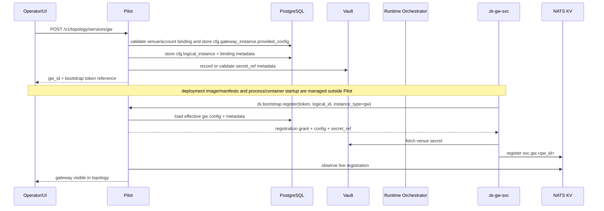
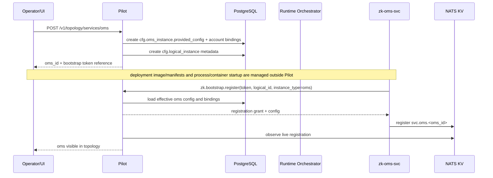
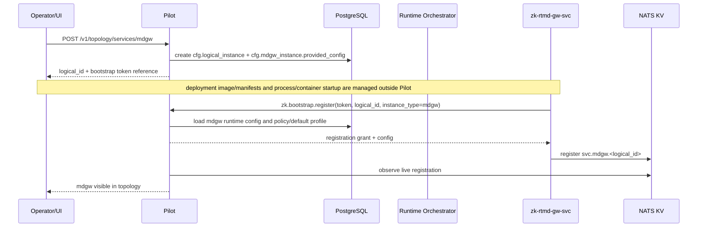
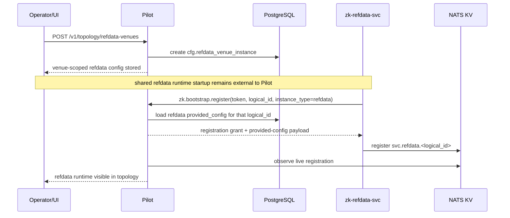
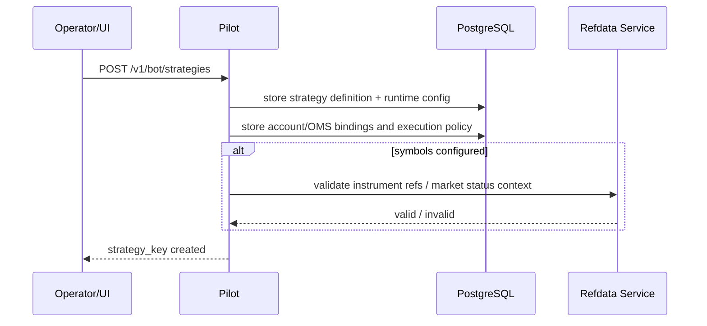
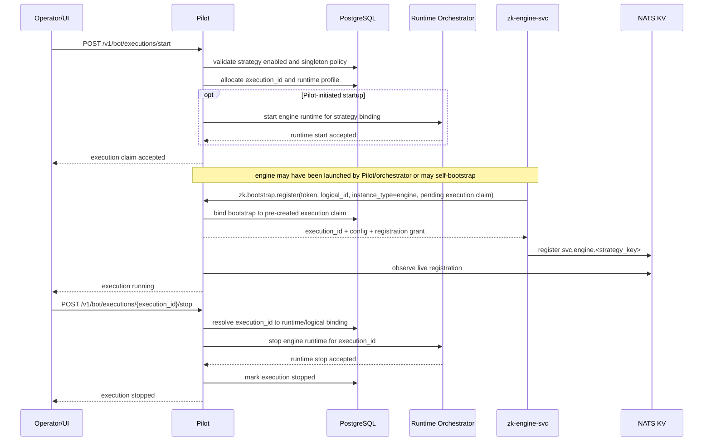
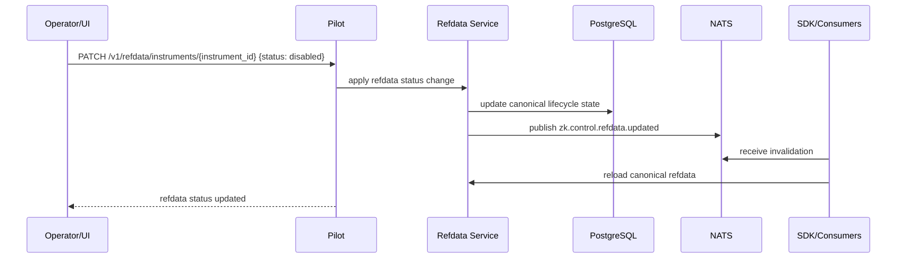

# Pilot Service

## Scope

`zk-pilot` is the control-plane service for topology, bootstrap authorization, runtime claims,
and dynamic configuration.

It owns:

- bootstrap registration and deregistration over NATS request/reply
- control-plane metadata in PostgreSQL
- schema and manifest resources exposed through a dedicated Pilot API group
- RTMD policy/default state and RTMD subscription observability
- topology reconciliation from NATS KV
- operator-facing REST control/query APIs
- ops workflows for runtime secret provisioning and orchestrator-facing runtime identity injection

Pilot should also be the admin and trade-facing UI backend for the system.

That means it is the primary control-plane surface for:

- manual trading and trade operations
- account views
- bot and strategy lifecycle management
- trading topology and configuration management
- refdata management
- risk configuration and monitoring views
- general trading operations workflows

## Design Role

Pilot is not on the steady-state data path for normal trading or RTMD publishing.

Pilot is authoritative for:

- whether a logical instance may start
- what runtime metadata/profile a service receives
- what schema/manifest versions are active for service kinds and venue capabilities
- singleton policy for strategies and other logical instances
- RTMD policy/defaults and global RTMD topology visibility
- control-plane aggregation for account, bot, refdata, and operations views

Pilot is not the liveness source of truth. Runtime liveness comes from KV registry state and is
reconciled back into Pilot state.

Pilot should also not be the steady-state hub or single forwarding point for RTMD subscription
changes while the system is running.

Pilot should also not become the hot-path execution or market-data transport layer. Its role is to
coordinate, aggregate, inspect, and initiate operations, not to sit in the middle of normal trading
message flow.

## Auth And Environment Notes

Pilot should use:

- external OIDC for authentication
- Pilot-local RBAC for authorization

See [Auth And Authorization](/Users/zzk/workspace/zklab/zkbot/docs/system-arch/auth.md).

Environment model:

- `env` is a property of the deployed Pilot instance
- typical deployment shape is one Pilot per environment such as `test` and `prod`

## Implementation Language Note

Pilot is no longer a small helper process. The target scope is trending toward:

- control-plane API hub
- auth/RBAC boundary
- topology and config service
- runtime-orchestrator client
- aggregation backend for admin and operator views
- later async jobs and possible live UI push

That profile fits a heavier service implementation better than a lightweight scripting-oriented
service.

Recommended direction:

- use Java for Pilot if that matches the team's stronger implementation language
- prefer Java 21 rather than a non-LTS JDK line for the first implementation

Why Java is a good fit:

- strong support for larger REST backends and layered service design
- mature ecosystem for OIDC, RBAC, DB migrations, typed APIs, schedulers, and admin workflows
- a good fit for DTO-heavy control-plane logic and long-lived backend maintenance
- better team velocity if Java is already the stronger language

Go would also be a reasonable choice:

- simpler runtime and deployment footprint
- strong for infra and control-plane services
- good concurrency model for background jobs

But the main priority should be:

- developer fluency first
- boring operability second
- language consistency last

A sane stack split is:

- Rust for hot-path and systems-facing runtime components
- Python for integration scripts and refdata loaders
- Java for the heavier Pilot control plane

Recommended Java tech stack:

- Java 21
- Gradle with Kotlin DSL
- Spring Boot
- Spring Web
- Spring Security
- OAuth2 Resource Server for OIDC/JWT validation
- Spring Validation
- Spring Actuator
- jOOQ or Spring JDBC for PostgreSQL access
- Flyway for schema migrations
- PostgreSQL JDBC driver
- NATS Java client
- Jackson
- Micrometer with Prometheus registry
- Testcontainers
- JUnit 5

Preferred implementation choices:

- build tool
  - Gradle with Kotlin DSL
  - commit the Gradle wrapper
- persistence
  - prefer jOOQ if the team wants typed SQL/result mapping
  - Spring JDBC is an acceptable leaner alternative
  - avoid making JPA/Hibernate the default unless the team already depends on it heavily
- auth
  - validate OIDC-issued JWTs in Pilot through Spring Security resource-server support
- discovery/runtime integration
  - use the NATS Java client directly for bootstrap request/reply, KV watch/cache, and control
    topics
- metrics
  - expose Actuator + Micrometer metrics and Prometheus scrape endpoint
- tests
  - use JUnit 5 and Testcontainers for PostgreSQL-backed integration tests

Process/orchestration implementation for the current phase:

- local dev/test first
  - use a small `ProcessBuilder`-backed adaptor behind a `RuntimeOrchestrator` interface
- local containerized development later
  - add a Docker-backed adaptor
- deployed environment later
  - add a Kubernetes-backed adaptor using a K8s client

Implementation note:

- keep bootstrap and service-discovery contracts language-agnostic
- keep PostgreSQL schema as the shared control-plane boundary
- keep runtime truth in KV/NATS independent of Pilot implementation language

Caution:

- moving Pilot to Java should not move runtime business truth into Pilot
- KV remains the liveness truth
- refdata service remains the refdata truth
- OMS remains the trading-state authority
- Pilot remains the control plane

## Java Service Discovery Note

If Pilot is implemented in Java, it should still maintain a small local service-discovery client
rather than resolving every downstream target dynamically on each request.

Recommended Java-side shape:

- one startup snapshot load from `zk-svc-registry-v1`
- one background watch loop that keeps an in-memory cache current
- request-time resolution from local memory rather than fresh KV lookups on every REST call
- helper lookups such as:
  - `findOms(omsId)`
  - `findGateway(gwId)`
  - `findMdgw(logicalId)`
  - `findRefdata()`

Why this is the recommended default:

- Pilot is an aggregator and operator backend, so many REST requests need repeated endpoint
  resolution
- per-request KV resolution adds avoidable latency and makes ordinary control-plane requests more
  dependent on transient NATS timing
- topology views already need an in-memory picture of current runtime registrations

Minimal useful Java implementation:

- `DiscoveryCache`
  - holds the latest live `ServiceRegistration` view keyed by `service_type` + `service_id`
- `DiscoveryWatcher`
  - loads the initial KV snapshot
  - applies watch updates in the background
  - rebuilds state cleanly after reconnect
- `DiscoveryResolver`
  - exposes typed lookup helpers for Pilot service classes and controllers

Suggested runtime contract:

1. on startup, Pilot loads the current KV snapshot before serving topology-dependent APIs
2. Pilot starts a background watch loop for incremental updates
3. REST handlers and aggregation services read from the in-memory cache
4. if the cache is not ready or the target is missing, Pilot returns an explicit control-plane
   error instead of performing ad hoc direct KV scans per request

Dynamic per-request resolution is acceptable only for:

- very low-frequency admin paths
- temporary scaffolding before the cache exists

It should not be the default architecture for the main Java Pilot service.

## Target Product Scope

Pilot should grow into the unified backend for operator UI, admin workflows, and ad hoc trade
operations.

Target scope:

### 1. Manual trading

- submit manual order/cancel requests through OMS-facing control APIs
- inspect order and trade status
- support operator-initiated panic/kill-switch actions

Design note:

- Pilot initiates or routes the operation through OMS/gateway control surfaces
- Pilot should not become a second independent order-state authority

### 2. Account views

- aggregated account balances
- positions
- open orders
- recent fills/trades

Design note:

- Pilot is an aggregator/query surface
- canonical live trading state remains in OMS/gateway/refdata-backed sources

### 3. Bot and strategy management

- strategy definition/config management
- execution start/stop/restart workflows
- current runtime state and topology visibility
- execution history and logs navigation

### 4. Trading topology and config management

- logical instance definitions
- account/OMS/gateway bindings

### 4.1 Schema and manifest management

Pilot should expose manifests and config schemas as first-class control-plane resources under a
dedicated API group such as `/v1/schema`.

Recommended rule:

- `/v1/schema` is the canonical read API for schema/manifest metadata and JSON Schema payloads
- bundled manifest/schema files in the codebase or binary are the authoritative contract
- Pilot persists schema/manifest resources in control-plane storage with explicit versioning and
  activation state

Authority rule:

- Pilot DB stores an operational mirror/registry of the authoritative bundled manifests
- normal schema evolution should happen through code change plus deployment, not hand-authored DB
  edits as the primary source
- `/v1/schema` should be read-first for ordinary operations
- admin/import APIs may exist for controlled sync, activation, or promotion workflows
- if the bundled authoritative manifest/schema and the active Pilot registry copy do not match,
  Pilot should surface an explicit error and fail closed for related validation/config operations

This is preferred over direct filesystem-backed schema serving because it:

- gives Pilot one operational registry surface without making DB state the schema authority
- lets Pilot own versioning, activation, validation, and deprecation state
- supports future admin workflows for publishing or promoting schema versions
- keeps local-process and future k3s orchestration aligned on one schema authority

Recommended resource split:

- service-kind schema resources
  - `oms`, `engine`, `gw`, `mdgw`
- venue capability schema resources
  - keyed by `venue` plus capability such as `gw`, `rtmd`, or `refdata`

Suggested API shape:

- `GET /v1/schema`
  - list schema resources and active versions
- `GET /v1/schema/service-kinds/{serviceKind}`
  - return manifest metadata for a service kind
- `GET /v1/schema/service-kinds/{serviceKind}/versions/{version}`
  - return a specific version
- `GET /v1/schema/venues/{venueId}/capabilities/{capability}`
  - return manifest metadata for a venue capability
- `GET /v1/schema/.../config`
  - return the JSON Schema payload used for validation and UI rendering

Simulator note:

- gateway simulator config should be represented as `venue=simulator`, `capability=gw`
- Pilot should compose the shared `service_kind/gw` schema with the simulator venue-capability
  schema when rendering onboarding and config-edit flows

Admin-only write APIs may be added later for schema import, activate, deprecate, and controlled
promotion workflows.

Design constraint:

- runtime bootstrap should not require the managed service to fetch schema on the hot path
- Pilot uses schemas for authoring, validation, introspection, and drift analysis
- managed services still receive already-validated runtime config during bootstrap
- Pilot should synchronize or verify its operational schema registry against the bundled
  authoritative manifests during startup or controlled import workflows
- venue module enablement

### 5. Operations and secret provisioning

- onboard venue/account secret material through controlled ops workflows
- write secret material to Vault and persist only references/metadata in Pilot storage
- create/update Vault access bindings for managed runtimes
- provision runtime Vault auth bootstrap inputs through the selected orchestrator backend
- support local process orchestration now and k3s later behind one shared interface

Design note:

- Pilot owns provisioning and orchestration coordination
- Vault remains the source of truth for secret material
- runtimes authenticate to Vault directly and resolve `secret_ref` at startup
- RTMD policy/defaults
- service-level runtime config authoring

Design note:

- for every bootstrap-managed runtime, Pilot should load the manifest/schema contract for that
  service kind to discover supported config types, capabilities, reload/restart hints, and UI form
  metadata
- venue-backed services such as gateway and RTMD should use the venue integration manifest and the
  relevant config schema
- non-venue services such as OMS and bot/engine should use a service-kind manifest/schema contract
- Pilot should use that manifest/schema data to render and validate onboarding/config forms
- Pilot should persist only the validated chosen configuration into control-plane tables
- the manifest/schema is the source for `provided_config` shape; Pilot DB remains the source of
  truth for the actual configured instances
- every bootstrap-managed runtime should expose a default `GetCurrentConfig` query so Pilot can
  inspect live `runtime_config`, show drift, and decide whether reload or restart is needed
- bootstrap-only fields required before Pilot contact belong to `bootstrap_config`, which is
  deployment/orchestrator owned rather than schema-authored by Pilot
- direct startup mode may still source `provided_config` fields from env vars for compatibility, but
  that does not change Pilot ownership of the logical control-plane config model

### 5.1 Simulator-backed gateway operations

Pilot should treat simulator-backed gateways as a first-class control-plane variant of `GW`, not as
a separate service family.

Recommended model:

- simulator gateways remain `service_kind=gw`
- simulator-specific config is selected through the venue capability path with `venue=simulator`
- Pilot should expose simulator instances in normal topology and service lists, with venue metadata
  making the simulator identity explicit
- simulator-only operational controls should be exposed through Pilot as an operator workflow,
  not mixed into the normal manual-trading API surface

Schema and config rule:

- shared gateway host/runtime config remains under the `service_kind/gw` schema resource
- simulator-specific runtime fields such as match policy, fill delay, seeded balances, and admin
  control enablement should come from the `venue_capability/simulator/gw` schema resource
- Pilot UI and validation should compose those two schema layers for simulator onboarding and
  config authoring

Admin-surface rule:

- simulator-only controls belong to the separate gateway admin gRPC surface described in
  [Gateway Simulator](/Users/zzk/workspace/zklab/zkbot/docs/system-arch/services/gateway_simulator.md)
- Pilot should be the operator-facing REST/UI backend for those workflows
- Pilot may proxy, orchestrate, or adapt that admin gRPC surface, but should not copy simulator
  semantics into the normal `GatewayService` or manual-trading REST domain

Operator workflow scope for simulator admin:

- pause or resume matching
- set match policy
- force deterministic fills
- inject and clear synthetic faults
- seed or reset account state
- submit synthetic ticks and other scenario-driving inputs
- inspect open orders, injected-error state, and current simulator state

Design constraint:

- simulator operations are test-harness and operator tooling
- they should remain clearly separated from production venue operations
- a simulator may be live in discovery while its matching engine is paused, so Pilot should model
  simulator readiness separately from ordinary service liveness

### 5. Refdata management

- browse/query refdata
- trigger refresh/reload workflows
- inspect refdata lifecycle state
- inspect market session/calendar state for TradFi venues

### 6. Risk control config and monitoring

- manage account/risk config
- inspect monitor/risk alerts
- expose operator-visible risk state summaries
- initiate panic/disable workflows where authorized

### 7. Other trading ops workflows

- topology inspection
- service/session inspection
- reconciliation/audit views
- operational reloads and bounded recovery workflows
- simulator-admin workflows for deterministic gateway control

## Legacy Mapping Notes

The legacy `zkbot/services/zk-service/src` codebase spreads these concerns across multiple ad hoc
services and APIs:

- `tq_service_api/api_service_strat.py`
  - strategy CRUD
  - execution start/stop
  - strategy log/order query
- `tq_service_api/api_service_instrument_refdata.py`
  - refdata browsing APIs
- `tq_service_app/tq_app.py`
  - account-style views
  - manual trading helpers through `TQClient`
  - followed-order workflows and app-facing API glue
- `tq_service_oms/ods_server.py`
  - account config lookup
  - refdata query
  - account summary/query helpers
  - route/config lookup
- `tq_service_riskmonitor/*`
  - rule-specific monitoring and alerting helpers

Pilot should absorb the control-plane and UI-backend responsibilities from those legacy pieces, but
not their old coupling patterns:

- no ODS-style startup dependency
- no Mongo-first control-plane config model
- no static subject registry as the primary topology mechanism
- no requirement that Pilot sit on the steady-state trading path

## Bounded Responsibilities

Pilot should own:

- control-plane APIs
- aggregation/query composition for the UI/backend
- lifecycle orchestration
- config and topology authoring
- bootstrap authorization
- policy/default state

Pilot should not own:

- canonical hot-path OMS mutation state
- gateway semantic unification
- RTMD hot-path subscription mediation
- refdata cache ownership inside clients
- long-lived exchange connectivity sessions
- deployment rollout as a primary responsibility of the control plane

## Runtime Orchestrator Adaptor

Pilot may use a backend runtime-orchestrator adaptor for bounded runtime operations such as:

- start
- stop
- restart

Examples:

- local process adaptor
- local Docker Engine adaptor
- Kubernetes / k3s API adaptor

Important boundary:

- this adaptor is for runtime operations only
- only bot/engine runtimes should use the orchestration start/stop path in the current design
- deployment and rollout should still go through the normal DevOps process
- Pilot should not become the primary deployment system for building, packaging, or releasing
  service workloads

Recommended staging:

- dev/test first: local process adaptor
- local containerized development later: Docker Engine adaptor
- deployed environment later: Kubernetes / k3s adaptor through a K8s client

Current scope rule:

- orchestration-backed start/stop is for bot execution runtimes
- gateways, OMS, and shared RTMD runtimes should not rely on Pilot orchestration start/stop in the
  current design
- for those services, Pilot may still expose config, topology, bootstrap-token, and reload flows

Recommended split:

- DevOps owns:
  - image build/publish
  - deployment manifests
  - cluster rollout and release process
- Pilot owns:
  - bot runtime start/stop/restart requests within an already deployed runtime environment
  - control-plane visibility of runtime status
  - coordination with bootstrap/topology state

Config/restart rule:

- config changes are written to DB-backed control-plane state
- Pilot should compare DB desired state to runtime-reported effective config through a standard
  `GetCurrentConfig` path
- running services may detect drift between in-memory runtime config and DB desired state
- reload vs restart should be classified from manifest/schema metadata for the service kind
- the operator decides when to issue reload or restart
- config management and restart operations should remain separate concerns

## Key Interfaces

- Bootstrap NATS subjects:
  - `zk.bootstrap.register`
  - `zk.bootstrap.deregister`
- REST:
  - manual trading and panic actions
  - account views
  - strategy execution start/stop/restart
  - OMS and service reload workflows
  - RTMD subscription policy CRUD and reload
  - topology, refdata, and risk-management queries

The REST surface is the primary Pilot API for UI/backend and ops workflows.

Current bootstrap implementation note:

- phase-1 Pilot currently implements only `zk.bootstrap.register` and `zk.bootstrap.deregister`
- the current wire contract still includes compatibility/reserved fields such as `lock_key`
- the active ownership and fencing mechanism today is CAS on `kv_key`
- scoped runtime credentials, active `lock_key` enforcement, reissue flows, and session-query
  subjects remain later hardening topics

## API Domains

Suggested Pilot REST APIs should be grouped by top-level resource area.

### 0. `/v1/meta`

- `GET /v1/meta`
  - return UI-facing metadata needed to render common dropdowns, filters, and form option lists
- `GET /v1/meta?domains=manual,accounts,topology,bot`
  - return only metadata subsets needed by the requested UI domains

Metadata response rule:

- the metadata API is a UI-support surface, not a new business authority
- it should return dropdown-ready option rows with `value` and `label`, plus small UI-relevant
  attributes such as `disabled`, `live`, `enabled`, `venue`, `oms_id`, or `tags`
- stable option sets should be grouped under `enums`
- control-plane or runtime-derived selectable references should be grouped under `refs`
- Pilot should aggregate and shape these lists so the UI does not need to fan out into many
  resource endpoints just to render filter bars and form selects

Recommended metadata contents:

- `enums`
  - order sides and order types
  - account, bot, service, alert, and instrument lifecycle statuses
  - service families and topology view modes
  - risk states and alert severities/categories
- `refs`
  - OMS options
  - venue options
  - account options
  - gateway options
  - MDGW options
  - bot/strategy options
  - instrument options
  - market options

Dynamic-form rule:

- `/v1/meta` should provide broad dropdown-ready lists used across many forms
- Pilot should also expose scoped option-list APIs for dependent fields that cannot be represented
  as one global list
- schema-driven UI authoring should consume:
  - JSON Schema for structural validation
  - manifest `field_descriptors` for widget and option-source hints
  - `/v1/meta` or scoped topology/meta endpoints for live option values

Recommended examples:

- `/v1/meta?domains=bot`
  - OMS list
  - strategy-type list
  - runtime kind labels
- scoped endpoints or scoped meta payloads
  - accounts for one `oms_id`
  - instruments for one OMS/account scope
  - gateway or venue-specific symbol lists when needed

Authority rule:

- UI metadata endpoints are advisory sources for operator selection UX
- backend validation remains authoritative and must reject invalid combinations even if the UI had
  previously offered them

### 1. `/v1/manual`

- `POST /v1/manual/orders:preview`
  - validate route, refdata status, and risk warnings before submit
- `POST /v1/manual/orders`
  - submit one manual order through the OMS-facing control path
- `POST /v1/manual/orders:batch`
  - submit multiple manual orders in one operator action
- `POST /v1/manual/cancels`
  - submit one or more manual cancel requests
- `POST /v1/manual/panic`
  - trigger operator panic/kill-switch for a scoped account or OMS
- `POST /v1/manual/panic/clear`
  - clear a previously asserted panic state where policy allows
- `GET /v1/manual/orders/{order_id}`
  - inspect manual-order status and downstream execution state
- `GET /v1/manual/trades`
  - inspect recent manual-trading fills and execution results

### 2. `/v1/accounts`

- `POST /v1/accounts`
  - create one trading account definition in control-plane storage
- `GET /v1/accounts`
  - list accounts visible to the operator or UI
- `PUT /v1/accounts/{account_id}`
  - update one trading account definition and control-plane metadata
- `GET /v1/accounts/{account_id}`
  - fetch summary view for one trading account
- `GET /v1/accounts/{account_id}/balances`
  - fetch current balance view for one account
- `GET /v1/accounts/{account_id}/positions`
  - fetch current positions for one account
- `GET /v1/accounts/{account_id}/orders/open`
  - fetch current open orders for one account
- `GET /v1/accounts/{account_id}/trades`
  - fetch recent trades/fills for one account
- `GET /v1/accounts/{account_id}/activities`
  - fetch mixed paginated account activity feed for UI detail views
- `GET /v1/accounts/{account_id}/runtime-binding`
  - fetch OMS/gateway/runtime binding summary for one account
- `POST /v1/accounts/{account_id}/orders/cancel`
  - cancel selected open orders for one account

### 3. `/v1/topology`

- `GET /v1/topology`
  - return current topology summary, with primary scope anchored on a selected live `oms_id`
- `PUT /v1/topology/bindings`
  - create or update logical topology bindings
- `GET /v1/topology/views`
  - list named topology and runtime views for UI/operator use
- `GET /v1/topology/views/{view_name}`
  - fetch one derived topology/runtime dataset, primarily scoped by a selected live `oms_id`
- `GET /v1/topology/services`
  - list managed service definitions and current control-plane metadata for the selected `oms_id`
- `GET /v1/topology/services/{service_kind}`
  - list one service family such as `oms`, `gw`, `mdgw`, or `bot` within the selected `oms_id`
- `GET /v1/topology/services/{service_kind}/{logical_id}`
  - fetch one managed service definition and current status
- `GET /v1/topology/services/{service_kind}/{logical_id}/bindings`
  - fetch bindings and related topology edges for one service
- `GET /v1/topology/services/{service_kind}/{logical_id}/audit`
  - fetch recent operational and control-plane audit items for one service
- `GET /v1/topology/sessions`
  - list active bootstrap/runtime sessions for the selected `oms_id`
- `POST /v1/topology/services/{service_kind}/{logical_id}/issue-bootstrap-token`
  - issue or rotate bootstrap token material for one logical service
- `POST /v1/topology/services/{service_kind}/{logical_id}/reload`
  - request a config reload for one logical service
- `GET /v1/topology/refdata-venues`
  - list venue-scoped refdata control-plane rows
- `GET /v1/topology/refdata-venues/{logical_id}`
  - fetch one refdata venue config row
- `POST /v1/topology/refdata-venues`
  - create one venue-scoped refdata config row

Design note:

- resource endpoints own semantic service actions
- generic `/v1/ops/*` endpoints own infrastructure-scoped runtime actions
- direct runtime service calls are used for logical control of already-live services
- the runtime-orchestrator adaptor is used for process/container/pod start, stop, and restart
- KV/discovery state remains the runtime truth for live-service presence
- topology view APIs should return normalized table-like datasets that the UI may render either as
  tables or as graphs
- topology inspection should be anchored on a selected live OMS instance, not a global unscoped
  network map, for the normal operator workflow
- simulator-backed gateways should appear in the same topology family as other gateways, but the UI
  should retain a venue-aware operator path for simulator-only actions

Topology view response rule:

- topology view endpoints should return structured rows/relations, not presentation-specific graph
  layout
- a view payload may include:
  - `nodes`
    - one row per service/runtime/group node with stable ids and status metadata
  - `edges`
    - one row per logical relationship such as bot -> OMS or OMS -> GW
  - `groups`
    - optional collapsed group rows for dense views
  - `scope`
    - current filter/scope metadata such as `oms_id`
- the frontend may render that dataset as:
  - a graph view
  - a segmented table view
  - a detail pane source

Topology scope rule:

- the primary topology scope is a selected live `oms_id`
- the UI should choose an online OMS instance first, then request topology data for that scope
- within that scope, Pilot returns the related bots, gateways, MDGW, refdata side authorities, and
  session/runtime metadata needed by the view
- unscoped global topology should be treated as a secondary admin/debug mode rather than the default
  operator topology workflow

Routing split:

- resource-owned semantic actions
  - examples: `ReloadConfig`, `StopStrategy`, refdata status changes, issue bootstrap token
  - Pilot validates the target resource type and current state before dispatch
- generic infra-scoped actions
  - examples: broader restart workflows, bounded rollout/restart across a selected runtime scope
  - these go through the runtime-orchestrator adaptor
- service-directed logical control
  - when a live runtime already exists and the action is part of that service's logical API,
    Pilot should call the service control surface directly rather than bouncing the process
- orchestrator-directed runtime control
  - when the action is about process lifecycle rather than service semantics, Pilot should use the
    orchestrator instead of inventing a service-local substitute

Current scope:

- in the current design, orchestration-backed runtime lifecycle applies only to bot/engine
  executions
- generic runtime restart should not be treated as the normal start path for gateways, OMS, or
  shared RTMD runtimes

### 4. `/v1/bot`

- `POST /v1/bot/strategies`
  - create a strategy definition and its baseline runtime config
- `PUT /v1/bot/strategies/{strategy_key}`
  - update strategy config or metadata
- `GET /v1/bot/strategies`
  - list strategy definitions
- `GET /v1/bot/strategies/{strategy_key}`
  - fetch one strategy definition and current status summary
- `POST /v1/bot/strategies/{strategy_key}/validate`
  - validate strategy config, bindings, and symbol references before activation
- `POST /v1/bot/executions/start`
  - request a new live execution claim for a strategy
- `POST /v1/bot/executions/{execution_id}/stop`
  - request stop/finalize for one live execution
- `POST /v1/bot/executions/{execution_id}/pause`
  - request pause for one live execution
- `POST /v1/bot/executions/{execution_id}/resume`
  - request resume for one live execution
- `POST /v1/bot/executions/{execution_id}/restart`
  - request bounded restart of a strategy execution
- `GET /v1/bot/executions`
  - list execution/run history across bots
- `GET /v1/bot/executions/{execution_id}`
  - fetch runtime status for one execution
- `GET /v1/bot/executions/{execution_id}/orders/open`
  - fetch current open orders for one execution
- `GET /v1/bot/executions/{execution_id}/activities`
  - fetch paginated execution activity feed
- `GET /v1/bot/executions/{execution_id}/lifecycles`
  - fetch lifecycle/control-state timeline for one execution
- `GET /v1/bot/executions/{execution_id}/logs`
  - fetch logs for one execution
- `GET /v1/bot/strategies/{strategy_key}/executions`
  - list execution history for one strategy
- `GET /v1/bot/strategies/{strategy_key}/logs`
  - fetch strategy logs for UI or operator inspection

### 5. `/v1/risk`

- `GET /v1/risk/accounts/{account_id}`
  - fetch current risk configuration and risk-state summary for one account
- `PUT /v1/risk/accounts/{account_id}`
  - update account-level risk config
- `GET /v1/risk/alerts`
  - list active or recent risk/monitor alerts
- `GET /v1/risk/alerts/{alert_id}`
  - fetch one alert with detailed context
- `GET /v1/risk/summary`
  - fetch aggregated cross-account or cross-OMS risk summary
- `POST /v1/risk/accounts/{account_id}/disable`
  - disable or freeze account trading by control-plane action
- `POST /v1/risk/accounts/{account_id}/enable`
  - re-enable account trading after operator review

### 6. `/v1/refdata`

- `GET /v1/refdata/instruments`
  - browse instrument refdata from the control-plane view
- `GET /v1/refdata/instruments/{instrument_id}`
  - fetch one instrument’s canonical refdata and lifecycle state
- `PATCH /v1/refdata/instruments/{instrument_id}`
  - update refdata lifecycle state such as disable/deprecate/reactivate
- `POST /v1/refdata/instruments/{instrument_id}/refresh`
  - request targeted refresh for one instrument
- `GET /v1/refdata/markets/{venue}/{market}/status`
  - fetch current market open/close/halt session state
- `GET /v1/refdata/markets/{venue}/{market}/calendar`
  - fetch market calendar and next-session context
- `POST /v1/refdata/refresh`
  - request broader refdata refresh workflow

### 7. `/v1/ops`

- `GET /v1/ops/audit/registrations`
  - inspect registration/bootstrap audit history
- `GET /v1/ops/audit/reconciliation`
  - inspect reconciliation/audit outcomes for operational review
- `POST /v1/ops/reconcile`
  - request a bounded reconciliation workflow across selected scopes

Later simulator-admin extension:

- `GET /v1/ops/simulators`
  - list simulator-backed gateway instances and operator-facing summary state
- `GET /v1/ops/simulators/{logical_id}`
  - return current simulator state snapshot
- `POST /v1/ops/simulators/{logical_id}/pause-matching`
- `POST /v1/ops/simulators/{logical_id}/resume-matching`
- `POST /v1/ops/simulators/{logical_id}/set-match-policy`
- `POST /v1/ops/simulators/{logical_id}/force-match`
- `POST /v1/ops/simulators/{logical_id}/inject-error`
- `GET /v1/ops/simulators/{logical_id}/injected-errors`
- `DELETE /v1/ops/simulators/{logical_id}/injected-errors/{error_id}`
- `POST /v1/ops/simulators/{logical_id}/account-state`
- `POST /v1/ops/simulators/{logical_id}/synthetic-ticks`
- `POST /v1/ops/simulators/{logical_id}/reset`

These should remain explicitly simulator-scoped and should map onto the separate
`GatewaySimulatorAdminService` semantics rather than widening the ordinary gateway or manual
trading domains.

## Common Query Conventions

List-style endpoints should support a consistent query contract where relevant.

Recommended query parameters:

- `limit`
- `cursor`
- `sort_by`
- `sort_order`
- `search`

Common filters by area:

- accounts
  - `venue`
  - `oms_id`
  - `status`
  - `risk`
- topology
  - `oms_id`
  - `family`
  - `service_kind`
  - `status`
  - `registration_kind`
- bot
  - `status`
  - `venue`
  - `oms_id`
  - `account_id`
  - `type`

Response-shaping rule:

- table/list endpoints should return compact rows plus pagination metadata
- detail endpoints should return richer operator-facing aggregates so the UI does not need to fan
  out into many sub-requests for ordinary page loads

## Domain Data Model Sketches

These are contract-level payload sketches for the main REST domains. They are not full OpenAPI
schemas, but they define the expected request/response shape closely enough for service
implementation and UI integration.

References:

- persistent/control-plane tables:
  [Data Layer](/Users/zzk/workspace/zklab/zkbot/docs/system-arch/data_layer.md)
- runtime/discovery registration payload:
  [API Contracts](/Users/zzk/workspace/zklab/zkbot/docs/system-arch/api_contracts.md)
- bootstrap/session semantics:
  [Service Discovery](/Users/zzk/workspace/zklab/zkbot/docs/system-arch/service_discovery.md)

### 0. Meta

Primary request sketches:

```json
{
  "domains": ["manual", "accounts", "topology", "bot"]
}
```

Primary response sketches:

```json
{
  "as_of": "2026-03-21T10:14:22Z",
  "env": "dev",
  "enums": {
    "service_families": [
      { "value": "bot", "label": "Bot" },
      { "value": "oms", "label": "OMS" },
      { "value": "gw", "label": "Gateway" },
      { "value": "mdgw", "label": "MDGW" },
      { "value": "refdata", "label": "Refdata" }
    ],
    "topology_views": [
      { "value": "graph", "label": "Graph" },
      { "value": "table", "label": "Table" }
    ],
    "account_statuses": [
      { "value": "active", "label": "Active" },
      { "value": "disabled", "label": "Disabled" }
    ],
    "bot_statuses": [
      { "value": "running", "label": "Running" },
      { "value": "paused", "label": "Paused" },
      { "value": "fenced", "label": "Fenced" },
      { "value": "stopped", "label": "Stopped" }
    ],
    "order_sides": [
      { "value": "BUY", "label": "Buy" },
      { "value": "SELL", "label": "Sell" }
    ],
    "order_types": [
      { "value": "MARKET", "label": "Market" },
      { "value": "LIMIT", "label": "Limit" },
      { "value": "POST_ONLY", "label": "Post Only" }
    ],
    "risk_states": [
      { "value": "ok", "label": "OK" },
      { "value": "warn", "label": "Warn" },
      { "value": "danger", "label": "Danger" }
    ],
    "alert_severities": [
      { "value": "LOW", "label": "Low" },
      { "value": "MED", "label": "Medium" },
      { "value": "HIGH", "label": "High" }
    ],
    "instrument_statuses": [
      { "value": "active", "label": "Active" },
      { "value": "disabled", "label": "Disabled" },
      { "value": "deprecated", "label": "Deprecated" }
    ]
  },
  "refs": {
    "oms": [
      {
        "value": "oms_okx",
        "label": "oms_okx",
        "live": true,
        "enabled": true,
        "venue": "OKX"
      }
    ],
    "venues": [
      { "value": "OKX", "label": "OKX" },
      { "value": "BINANCE", "label": "Binance" }
    ],
    "accounts": [
      {
        "value": "123",
        "label": "123 / okx-main-123",
        "venue": "OKX",
        "oms_id": "oms_okx",
        "gw_id": "gw_okx_123",
        "status": "active",
        "risk": "warn"
      }
    ],
    "gateways": [
      {
        "value": "gw_okx_123",
        "label": "gw_okx_123",
        "venue": "OKX",
        "oms_id": "oms_okx",
        "live": true,
        "enabled": true
      }
    ],
    "mdgws": [
      {
        "value": "mdgw_okx",
        "label": "mdgw_okx",
        "venue": "OKX",
        "live": true,
        "enabled": true
      }
    ],
    "bots": [
      {
        "value": "mm_btc",
        "label": "mm_btc",
        "strategy_key": "mm_btc",
        "oms_id": "oms_okx",
        "venue": "OKX",
        "status": "running",
        "type": "market_making"
      }
    ],
    "instruments": [
      {
        "value": "BTC-USDT.OKX",
        "label": "BTC-USDT / OKX",
        "symbol": "BTC-USDT",
        "venue": "OKX",
        "type": "SPOT",
        "status": "active",
        "market": "crypto/24x7"
      }
    ],
    "markets": [
      {
        "value": "OKX:crypto/24x7",
        "label": "OKX / crypto/24x7",
        "venue": "OKX"
      }
    ]
  }
}
```

Reference model:

- `enums` are Pilot-owned API constants and UI-facing controlled vocabularies
- `refs` are aggregated from control-plane tables and live discovery/runtime state
- the metadata API should return dropdown-ready labels rather than raw DB rows
- the UI should use this endpoint for filter bars and select controls instead of hardcoding lists or
  joining multiple domain endpoints for basic form rendering

### 1. Manual

Primary request sketches:

```json
{
  "account_id": "123",
  "instrument_id": "BTC-USDT.OKX",
  "side": "BUY",
  "order_type": "LIMIT",
  "price": "83420",
  "qty": "0.75",
  "time_in_force": "GTC",
  "note": "manual hedge"
}
```

```json
{
  "account_id": "123",
  "order_ids": ["8901221", "8901228"]
}
```

Primary response sketches:

```json
{
  "preview": {
    "oms_id": "oms_okx",
    "gw_id": "gw_okx_123",
    "account_status": "ACTIVE",
    "instrument_status": "active",
    "risk_warnings": ["max_order_qty_near_limit"]
  }
}
```

```json
{
  "order_id": "8901221",
  "client_order_id": "cl-9912",
  "status": "ACCEPTED",
  "oms_id": "oms_okx",
  "gw_id": "gw_okx_123",
  "accepted_at": "2026-03-21T10:14:01Z"
}
```

Reference model:

- request borrows OMS/gateway command semantics from
  [API Contracts](/Users/zzk/workspace/zklab/zkbot/docs/system-arch/api_contracts.md)
- response is an operator-facing aggregate, not the canonical OMS internal state model

### 2. Accounts

Primary request sketches:

```json
{
  "account_id": "123",
  "alias": "okx-main-123",
  "venue": "OKX",
  "broker_type": "crypto",
  "account_type": "spot",
  "status": "ACTIVE",
  "base_currency": "USD"
}
```

```json
{
  "account_id": "123",
  "alias": "okx-main-123",
  "status": "SUSPENDED"
}
```

Primary response sketches:

```json
{
  "account_id": "123",
  "alias": "okx-main-123",
  "venue": "OKX",
  "oms_id": "oms_okx",
  "gw_id": "gw_okx_123",
  "status": "ACTIVE",
  "balance_summary": "0.91m",
  "market_value": "1.24m",
  "position_count": 4,
  "open_order_count": 12,
  "orders_24h": 84,
  "trades_24h": 31,
  "risk_state": "WARN"
}
```

```json
{
  "account_id": "123",
  "runtime_binding": {
    "oms_id": "oms_okx",
    "gw_ids": ["gw_okx_123"],
    "startup_sync": true,
    "last_binding_update": "2026-03-21T10:14:22Z"
  },
  "balances": [],
  "positions": [],
  "open_orders": [],
  "activities": []
}
```

Reference model:

- control-plane account fields map primarily to `cfg.account` and `cfg.account_binding` in
  [Data Layer](/Users/zzk/workspace/zklab/zkbot/docs/system-arch/data_layer.md)
- live balances, positions, and orders are Pilot aggregates over OMS/gateway sources

### 3. Topology

Primary request sketches:

```json
{
  "oms_id": "oms_okx",
  "view": "graph",
  "include_groups": true
}
```

```json
{
  "src_type": "BOT",
  "src_id": "mm_btc",
  "dst_type": "OMS",
  "dst_id": "oms_okx",
  "enabled": true,
  "metadata": {}
}
```

Primary response sketches:

```json
{
  "scope": {
    "oms_id": "oms_okx",
    "as_of": "2026-03-21T10:14:22Z"
  },
  "nodes": [
    {
      "logical_id": "mm_btc",
      "service_kind": "bot",
      "registration_kind": "strategy",
      "status": "live",
      "endpoint": "10.0.0.41:5301",
      "version": "1.3.0",
      "drift": "NO",
      "session_id": "sess_eng_101",
      "desired_enabled": true
    }
  ],
  "edges": [
    {
      "edge_type": "bot_to_oms",
      "src_id": "mm_btc",
      "dst_id": "oms_okx",
      "status": "active"
    }
  ],
  "groups": []
}
```

```json
{
  "logical_id": "gw_okx_123",
  "service_kind": "gw",
  "registration_kind": "gw",
  "desired_enabled": true,
  "live_status": "degraded",
  "endpoint": "10.0.0.12:5201",
  "version": "1.1.7",
  "last_seen_at": "2026-03-21T10:14:22Z",
  "config_drift": "YES",
  "bindings": [],
  "sessions": []
}
```

Reference model:

- control-plane service metadata maps to `cfg.logical_instance` and `cfg.logical_binding`
- live state/session view maps to discovery KV and `mon.active_session`

### 4. Bot

Primary request sketches:

```json
{
  "strategy_key": "mm_btc",
  "runtime_type": "RUST",
  "code_ref": "strategies/mm_btc",
  "oms_id": "oms_okx",
  "account_scope": ["123", "456"],
  "venue": "OKX",
  "config": {}
}
```

```json
{
  "strategy_key": "mm_btc",
  "reason": "operator_start",
  "runtime_params": {}
}
```

```json
{
  "reason": "operator_pause"
}
```

Primary response sketches:

```json
{
  "strategy_key": "mm_btc",
  "status": "RUNNING",
  "type": "market_making",
  "venue": "OKX",
  "oms_id": "oms_okx",
  "current_execution_id": "exec_101",
  "account_scope": ["123", "456"],
  "open_order_count": 12,
  "last_start_at": "2026-03-21T10:12:11Z",
  "last_operator_action": "resume"
}
```

```json
{
  "execution_id": "exec_101",
  "strategy_key": "mm_btc",
  "status": "RUNNING",
  "session_id": "sess_eng_101",
  "endpoint": "10.0.0.41:5301",
  "lifecycle": [],
  "activities": [],
  "open_orders": []
}
```

Reference model:

- control-plane bot definition should align with strategy/execution tables in
  [Data Layer](/Users/zzk/workspace/zklab/zkbot/docs/system-arch/data_layer.md)
- live execution state should align with engine registration and runtime/session metadata

### 5. Risk

Primary request sketches:

```json
{
  "max_daily_notional": "1000000",
  "max_net_position": "250000",
  "max_order_rate_per_s": 30,
  "panic_on_reject_count": 5,
  "extra_config": {}
}
```

Primary response sketches:

```json
{
  "account_id": "123",
  "oms_id": "oms_okx",
  "risk_config": {},
  "risk_state": "WARN",
  "active_alert_count": 1,
  "latest_alerts": []
}
```

Reference model:

- control-plane risk config maps primarily to `cfg.oms_risk_config`
- alert/state summaries are Pilot aggregates over monitor/risk sources

### 6. Refdata

Primary request sketches:

```json
{
  "status": "disabled",
  "reason": "operator_disable"
}
```

```json
{
  "venue": "OKX",
  "instrument_type": "SPOT",
  "status": "active"
}
```

Primary response sketches:

```json
{
  "instrument_id": "BTC-USDT.OKX",
  "venue": "OKX",
  "instrument_exch": "BTC-USDT",
  "instrument_type": "SPOT",
  "lifecycle_status": "active",
  "updated_at": "2026-03-21T10:03:11Z"
}
```

```json
{
  "market": {
    "venue": "NASDAQ",
    "market": "us-cash",
    "status": "OPEN",
    "updated_at": "2026-03-21T09:31:09Z"
  }
}
```

Reference model:

- canonical refdata fields map to `cfg.instrument_refdata`
- richer payloads should proxy/aggregate from the refdata service rather than inventing a new
  Pilot-local source of truth

### 7. Ops

Primary request sketches:

```json
{
  "scope": {
    "oms_id": "oms_okx",
    "service_kind": "gw"
  },
  "reason": "operator_reconcile"
}
```

Primary response sketches:

```json
{
  "status": "ACCEPTED",
  "job_id": "job_reconcile_101",
  "scope": {
    "oms_id": "oms_okx"
  }
}
```

```json
{
  "rows": [
    {
      "time": "2026-03-21T10:14:33Z",
      "actor": "ops_a",
      "action": "restart",
      "target": "oms_okx",
      "result": "OK",
      "request_id": "req_101"
    }
  ]
}
```

Reference model:

- ops audit rows map to `mon.registration_audit` plus broader Pilot audit tables as they are added
- reconcile/job responses should be revisited once the async job model is finalized

## User-Initiated Workflows

The following workflows are initiated by an operator or UI through Pilot. Pilot coordinates the
control-plane changes, but the actual runtime services remain responsible for bootstrap, live
registration, and hot-path behavior.

## Platform Ops Bootstrap Flow

For a new environment or a newly enabled trading scope, platform/bootstrap ops should follow this
order:

1. create accounts in control-plane storage
2. onboard service metadata and bindings into control-plane storage
3. start OMS / GW / other required runtimes so they bootstrap and register live
4. once live registration is present, topology, manual trading, and live account views become
   usable

Practical sequence:

### 1. Create accounts

- store account definitions in PostgreSQL control-plane tables
- include venue/account identity, status, and required bindings metadata

### 2. Onboard services

- store OMS / GW / MDGW / bot logical-instance metadata in PostgreSQL
- store bindings such as:
  - account -> OMS
  - OMS -> GW
  - bot -> OMS
- issue bootstrap tokens and required control-plane metadata

### 3. Start runtimes for live registration

- start OMS / GW / other required runtimes through the environment's normal runtime path
- each runtime performs normal `zk.bootstrap.register`
- each runtime registers live state in `zk-svc-registry-v1`

### 4. Enable operator workflows

- topology becomes meaningful once live registrations exist
- manual trading becomes usable once the relevant OMS / GW path is live
- account live views become usable once OMS state and bindings are available

Readiness rule:

- control-plane rows alone are not enough to treat a trading scope as operational
- the scope should be considered operator-ready only after the required runtime registrations are
  live in KV

### 1. Onboard A Trading Gateway

Goal:

- enable a ready venue integration package/binary as a managed gateway runtime for one account scope

Manifest/config rule:

- Pilot should load the selected venue integration manifest and gateway config schema during
  onboarding
- the manifest/schema should drive the rendered config fields, supported capability toggles, and
  validation rules
- submitted gateway config should be validated against the same schema before Pilot stores it
- gateway should expose `GetCurrentConfig` so Pilot can compare desired config to the currently
  loaded effective config and classify reload vs restart
- Pilot should persist gateway `provided_config` in `cfg.gateway_instance`, and keep
  `cfg.logical_instance` as identity/topology only

Required control-plane endpoints:

- `POST /v1/topology/services/gw`
- `GET /v1/topology/services/gw/{gw_id}`
- `POST /v1/topology/services/gw/{gw_id}/reload`
- `POST /v1/topology/services/gw/{gw_id}/issue-bootstrap-token`



### 2. Onboard An OMS

Goal:

- create and enable an OMS runtime with account bindings and gateway topology

Manifest/config rule:

- Pilot should load the OMS manifest/schema contract during onboarding and config editing
- the manifest/schema should drive rendered config fields, validation, and reload vs restart
  classification
- submitted OMS config should be validated against the same schema before Pilot stores it
- OMS should expose `GetCurrentConfig` so Pilot can compare desired config to the currently loaded
  effective config and show drift
- Pilot should persist OMS `provided_config` in `cfg.oms_instance`, and keep `cfg.logical_instance`
  as identity/topology only

Required control-plane endpoints:

- `POST /v1/topology/services/oms`
- `GET /v1/topology/services/oms/{oms_id}`
- `POST /v1/topology/services/oms/{oms_id}/reload`
- `POST /v1/topology/services/oms/{oms_id}/issue-bootstrap-token`



### 3. Onboard An RTMD Gateway

Goal:

- enable a ready venue RTMD integration as a shared market-data runtime

Manifest/config rule:

- Pilot should load the selected venue integration manifest and RTMD config schema during
  onboarding
- the manifest/schema should drive the rendered config fields, supported RTMD channel/profile
  options, and validation rules
- submitted RTMD config should be validated against the same schema before Pilot stores it
- MDGW should expose `GetCurrentConfig` so Pilot can compare desired config to the currently loaded
  effective config and classify reload vs restart
- Pilot should persist MDGW `provided_config` in `cfg.mdgw_instance`, and keep `cfg.logical_instance`
  as identity/topology only

Required control-plane endpoints:

- `POST /v1/topology/services/mdgw`
- `GET /v1/topology/services/mdgw/{logical_id}`
- `POST /v1/topology/services/mdgw/{logical_id}/reload`
- `POST /v1/topology/services/mdgw/{logical_id}/issue-bootstrap-token`



### 4. Onboard A Refdata Venue Instance

Goal:

- create one venue-scoped control-plane config row for the shared refdata runtime

Manifest/config rule:

- Pilot should load the selected venue integration manifest and `refdata` config schema
- submitted refdata config should be validated against the venue capability schema before Pilot
  stores it
- Pilot should persist refdata `provided_config` in `cfg.refdata_venue_instance`
- if the shared refdata runtime is bootstrap-managed as a logical service, the matching
  `cfg.logical_instance` row remains the identity/topology authority

Required control-plane endpoints:

- `POST /v1/topology/refdata-venues`
- `GET /v1/topology/refdata-venues/{logical_id}`



### 5. Onboard A Strategy

Goal:

- create a strategy definition and the control-plane config needed for future executions

Manifest/config rule:

- Pilot should load the bot/engine manifest/schema contract during strategy authoring and config
  editing
- the manifest/schema should define config shape, capability flags, and reload vs restart
  constraints for the runtime
- submitted bot/engine config should be validated against the same schema before Pilot stores it
- the engine runtime should expose `GetCurrentConfig` so Pilot can compare desired execution/runtime
  config to the live effective config before recommending reload or restart

Required control-plane endpoints:

- `POST /v1/bot/strategies`
- `PUT /v1/bot/strategies/{strategy_key}`
- `GET /v1/bot/strategies/{strategy_key}`
- `POST /v1/bot/strategies/{strategy_key}/validate`



### 5. Start Or Stop A Strategy

Goal:

- claim or release a live strategy execution

Execution ownership rule:

- Pilot owns singleton enforcement and `execution_id` allocation
- runtime orchestration and runtime bootstrap are separate steps
- regardless of how the process is launched, the engine must perform the normal
  `zk.bootstrap.register` flow itself
- bootstrap binds the engine to an already-created execution claim and returns the assigned
  `execution_id` plus effective runtime config

Startup modes:

- self-bootstrap
  - an already deployed engine process starts on its own and calls normal bootstrap/register
- Pilot-initiated bootstrap
  - Pilot asks the runtime orchestrator to launch the engine process
  - the launched engine then performs the same normal bootstrap/register flow itself

Boundary rule:

- the runtime orchestrator may start or stop the process/container/pod
- the runtime orchestrator does not replace service bootstrap or service registration
- the engine remains responsible for authenticating to Pilot, fetching config, and registering
  itself in KV

Required control-plane endpoints:

- `POST /v1/bot/executions/start`
- `POST /v1/bot/executions/{execution_id}/stop`
- `GET /v1/bot/executions/{execution_id}`
- `GET /v1/bot/strategies/{strategy_key}/executions`



### 6. Modify Refdata Status

Goal:

- change refdata lifecycle state, for example disable an instrument

Required control-plane endpoints:

- `PATCH /v1/refdata/instruments/{instrument_id}`
- `GET /v1/refdata/instruments/{instrument_id}`
- `POST /v1/refdata/instruments/{instrument_id}/refresh`



Design note:

- Pilot may proxy the operator request, but the refdata service remains the canonical runtime
  refdata authority

## TODO

- async job model for long-running workflows such as refresh, reconcile, and bounded restart
- extend audit tables and audit flows to cover the newer control-plane scenarios
- partial-failure semantics for multi-step control-plane workflows
- Pilot health/SLO design and degraded-mode behavior
- export/reporting workflow design
- manual-trading safety rails and confirmation policy

## Topology And Registration Policy

Pilot interprets business meaning from `cfg.logical_instance.metadata`.

Examples:

- `registration_kind: "gw"`
- `registration_kind: "oms"`
- `registration_kind: "strategy"`
- `registration_kind: "engine+mdgw"`
- `registration_kind: "oms+gw+strategy"`

This keeps the registry contract generic while allowing Pilot to enforce:

- strategy singleton ownership
- composite deployment constraints
- venue/account scope validation
- embedded RTMD publisher policy

## Runtime Config And Secret Ownership

Pilot should own effective runtime configuration, but it should not own raw secret delivery.

This follows the shared bootstrap decision in
[Bootstrap And Runtime Config](/Users/zzk/workspace/zklab/zkbot/docs/system-arch/bootstrap_and_runtime_config.md).

Recommended contract:

- deployment tooling provides only minimal bootstrap config needed to reach Pilot and Vault
- Pilot stores and serves effective service config from control-plane tables
- Pilot returns metadata such as:
  - `secret_ref`
  - account binding
  - venue scope
  - capability flags
  - service-specific config payload
- Pilot does not return raw trading credentials, API keys, or secret values

Secret retrieval model:

- the runtime service authenticates directly to Vault using workload identity
- the runtime service reads secret material from the returned `secret_ref`
- Vault remains the secret source of truth

Configuration model:

- minimal deployment config remains deployment-owned
- production config is Pilot-managed
- devops automation seeds the same Pilot-managed schema during environment creation
- local env/file overrides are for local development and emergency debugging only

This keeps Pilot authoritative for bootstrap and topology while avoiding a steady-state secret hub.

## RTMD Subscription Management

Pilot manages control-plane RTMD policy/default state in `cfg.mdgw_subscription`.

Pilot should not be required on the hot path when a client subscribes a new symbol.

Recommended split:

- clients publish live subscription interest directly into a dedicated KV space such as `zk-rtmd-subs-v1`
- RTMD gateways watch that live interest and react quickly
- Pilot watches the same live interest for observability and policy enforcement

Pilot responsibilities:

- materialize `cfg.mdgw_subscription` policy/default rows into Pilot-owned RTMD interest where
  operator policy wants baseline subscriptions
- inspect current RTMD subscription topology
- adjust or withdraw Pilot-owned RTMD interest when operator policy changes
- expose admin APIs for subscription inspection and management

Normal-source rule:

- Pilot should behave as a normal source of RTMD subscription interest
- Pilot may create, refresh, or remove its own interest records
- Pilot should not directly delete or unsubscribe another runtime client’s live interest record
- effective upstream unsubscribe should happen only when the last active interest for that stream is
  gone

Separation rule:

- `zk-svc-registry-v1` remains the service discovery/liveness bucket
- `zk-rtmd-subs-v1` is used for live RTMD subscription leases

Pilot triggers reconciliation through:

- `zk.control.mdgw.<venue>.reload`
- `zk.control.mdgw.<logical_id>.reload`

Pilot may derive effective views for venue-wide and logical-instance-scoped RTMD runtimes, but it
should not be the only component that notices live runtime subscription adds/removes.

## Related Docs

- [Architecture](/Users/zzk/workspace/zklab/zkbot/docs/system-arch/arch.md)
- [Auth And Authorization](/Users/zzk/workspace/zklab/zkbot/docs/system-arch/auth.md)
- [Service Discovery](/Users/zzk/workspace/zklab/zkbot/docs/system-arch/service_discovery.md)
- [RTMD Subscription Protocol](/Users/zzk/workspace/zklab/zkbot/docs/system-arch/rtmd_subscription_protocol.md)
- [Topology Registration](/Users/zzk/workspace/zklab/zkbot/docs/system-arch/topology_registration.md)
- [API Contracts](/Users/zzk/workspace/zklab/zkbot/docs/system-arch/api_contracts.md)
- [Data Layer](/Users/zzk/workspace/zklab/zkbot/docs/system-arch/data_layer.md)
