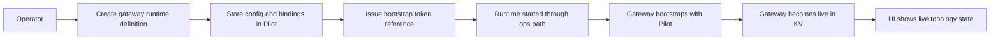
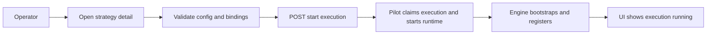
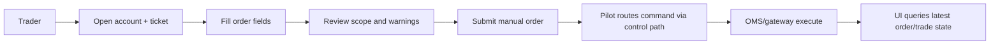
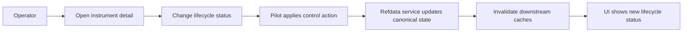

# Pilot Console UI

## Goal

Define a practical operator UI for the current architecture:

- Pilot is the control-plane and UI backend
- OMS is the trading-state authority
- KV is the runtime liveness truth
- refdata service is the canonical refdata authority
- gateways and RTMD gateways remain runtime services, not UI backends

The UI should help an operator:

- inspect current topology and runtime state
- perform bounded operational actions
- manage strategies, services, refdata, and risk settings
- do manual trading through controlled APIs

Phase-1 assumption:

- UI is query/command driven
- no live websocket push is required yet
- pages refresh or poll through Pilot REST APIs

## Product Shape

Recommended product shape:

- one web console per Pilot environment
- explicit environment branding in the shell, for example `TEST`, `UAT`, `PROD`
- role-aware navigation based on Pilot RBAC

Suggested frontend stack:

- TypeScript
- React
- Vite
- Tailwind CSS
- shadcn/ui
- TanStack Query
- AG Grid
- a small routing layer
- thin design system with operator-first tables/forms/status components

The UI should stay thin:

- do not duplicate control-plane policy logic in the browser
- do not derive runtime truth independently of Pilot
- do not speak directly to OMS, gateways, RTMD gateways, or refdata service from the browser

## Tech Stack Recommendation

Recommended stack:

- `Vite`
- `React`
- `TypeScript`
- `Tailwind CSS`
- `shadcn/ui`
- `TanStack Query`
- `AG Grid`

Why this fits the Pilot console:

- `Vite`
  - fast local iteration and low-friction app scaffolding
- `React`
  - good fit for a multi-screen operator console with shared page patterns
- `Tailwind CSS`
  - fast to build dense operational layouts without a heavy custom CSS system
- `shadcn/ui`
  - good base for dialogs, drawers, forms, menus, and shell components without forcing a large
    opinionated design system
- `TanStack Query`
  - strong fit for Pilot’s query/command and polling-oriented page model
- `AG Grid`
  - good fit for dense operational tables such as:
    - accounts
    - positions
    - orders
    - services
    - sessions
    - audit views

Recommended usage split:

- `AG Grid` for dense data-heavy operational views
- `shadcn/ui` for shell, forms, dialogs, filters, drawers, and detail panels
- `TanStack Query` for all Pilot REST reads plus mutation state handling

Recommended additions around that stack:

- `React Router` or `TanStack Router`
- `React Hook Form`
- `Zod`

Why not rely on `shadcn/ui` tables alone:

- the Pilot console will likely need:
  - high-density grids
  - column pinning
  - sorting/filtering
  - expandable details
  - large operational datasets

That is where `AG Grid` is a better fit than lightweight table primitives.

## UX Principles

- operator-first, not marketing-style
- dense but readable information layout
- stable navigation and terminology
- explicit environment and account scope everywhere
- every dangerous action must show scope before submit
- read views should always show data freshness and source

## Information Architecture

Top-level navigation:

1. Overview
2. Trading
3. Strategies
4. Topology
5. Refdata
6. Risk
7. Ops
8. Audit

Suggested role emphasis:

- `viewer`
  - Overview, Topology, Refdata, Risk, Audit
- `trader`
  - Trading, account views, manual order actions
- `bot_manager`
  - Strategies, start/stop/restart, logs
- `ops`
  - Topology, service runtime ops, reload/restart, audit
- `risk_manager`
  - Risk config, alerts, disable/enable workflows
- `admin`
  - all areas

## App Shell

Recommended shell layout:

```text
+----------------------------------------------------------------------------------+
| Pilot Console | PROD | user@company | global search | alerts | refresh status   |
+----------------------+-----------------------------------------------------------+
| Nav                  | Page header                                               |
| - Overview           | title / scope / freshness / actions                       |
| - Trading            +-----------------------------------------------------------+
| - Strategies         |                                                           |
| - Topology           | page body                                                 |
| - Refdata            | tables, filters, forms, logs, detail panes                |
| - Risk               |                                                           |
| - Ops                |                                                           |
| - Audit              |                                                           |
+----------------------+-----------------------------------------------------------+
```

Persistent shell elements:

- environment badge
- current user / role
- global freshness indicator
- active alert count
- optional command/search entry

## Main Screens

Panel docs:

- [Overview](/Users/zzk/workspace/zklab/zkbot/docs/ui-design/panels/overview.md)
- [Trading](/Users/zzk/workspace/zklab/zkbot/docs/ui-design/panels/trading.md)
- [Strategies](/Users/zzk/workspace/zklab/zkbot/docs/ui-design/panels/strategies.md)
- [Topology](/Users/zzk/workspace/zklab/zkbot/docs/ui-design/panels/topology.md)
- [Refdata](/Users/zzk/workspace/zklab/zkbot/docs/ui-design/panels/refdata.md)
- [Risk](/Users/zzk/workspace/zklab/zkbot/docs/ui-design/panels/risk.md)
- [Ops](/Users/zzk/workspace/zklab/zkbot/docs/ui-design/panels/ops.md)
- [Audit](/Users/zzk/workspace/zklab/zkbot/docs/ui-design/panels/audit.md)

## Key Workflows

### 1. Onboard Gateway



### 2. Start Strategy



### 3. Manual Trading



### 4. Refdata Status Change



## Backend API Mapping

The UI should map directly onto Pilot REST domains already discussed.

Trading:

- `GET /v1/accounts`
- `GET /v1/accounts/{account_id}`
- `GET /v1/accounts/{account_id}/balances`
- `GET /v1/accounts/{account_id}/positions`
- `GET /v1/accounts/{account_id}/orders/open`
- `GET /v1/accounts/{account_id}/trades`
- `POST /v1/manual/orders`
- `POST /v1/manual/cancels`
- `POST /v1/manual/panic`

Strategies:

- `GET /v1/strategies`
- `GET /v1/strategies/{strategy_key}`
- `POST /v1/strategies`
- `PUT /v1/strategies/{strategy_key}`
- `POST /v1/strategies/{strategy_key}/validate`
- `POST /v1/strategy-executions/start`
- `POST /v1/strategy-executions/stop`
- `POST /v1/strategy-executions/{execution_id}/restart`

Topology / Ops:

- `GET /v1/topology`
- `GET /v1/topology/services`
- `GET /v1/topology/sessions`
- `POST /v1/gateways`
- `POST /v1/oms`
- `POST /v1/mdgw`
- `POST /v1/services/{logical_id}/reload`
- `POST /v1/ops/restart`

Refdata:

- `GET /v1/refdata/instruments`
- `GET /v1/refdata/instruments/{instrument_id}`
- `PATCH /v1/refdata/instruments/{instrument_id}`
- `POST /v1/refdata/instruments/{instrument_id}/refresh`
- `GET /v1/refdata/markets/{venue}/{market}/status`
- `GET /v1/refdata/markets/{venue}/{market}/calendar`

Risk:

- `GET /v1/risk/summary`
- `GET /v1/risk/accounts/{account_id}`
- `PUT /v1/risk/accounts/{account_id}`
- `GET /v1/risk/alerts`
- `GET /v1/risk/alerts/{alert_id}`
- `POST /v1/risk/accounts/{account_id}/disable`
- `POST /v1/risk/accounts/{account_id}/enable`

Audit:

- `GET /v1/audit/registrations`
- `GET /v1/audit/reconciliation`

## State And Refresh Model

Phase 1:

- page load fetch
- manual refresh
- light polling for operational pages

Suggested polling behavior:

- Overview: 10-15s
- Topology / service status: 5-10s
- Strategy execution detail: 5s
- Manual order/trade result views: 2-5s while active
- Refdata pages: manual or 30s
- Audit: manual

Page state should show:

- last refreshed time
- source freshness if available
- loading / stale / error state explicitly

## Visual Language

Recommended visual direction:

- dark-on-light operator console
- dense tables with strong row states
- muted neutrals with status colors used sparingly
- avoid dashboard-card overload
- use split-pane detail layouts for operational pages

Suggested status colors:

- live / healthy: green
- degraded: amber
- down / failed / fenced: red
- disabled / blocked: slate
- pending / restarting: blue

## Phase Delivery

### Phase 1

- Pilot-backed operator console
- query/command pages only
- polling, not websocket push
- core screens:
  - Overview
  - Accounts / Trading
  - Strategies
  - Topology
  - Refdata
  - Risk
  - Audit

### Phase 2

- finer-grained role-based navigation
- live UI updates for alerts and runtime status
- saved filters and operator views
- richer logs and reconciliation views

### Phase 3

- operator workflow jobs
- live notifications
- bulk actions
- more advanced risk/trading operations

## Non-Goals

- direct browser access to runtime services
- deployment/release management
- replacing OMS/gateway/refdata domain authority in the frontend
- rich charting or research UI in the first control-plane console

## Open UI Questions

- whether one codebase should serve both admin and trader personas or use separate shells
- whether logs should be shown directly in Pilot or linked out to a log backend
- how much topology graphing is useful before it becomes noise
- whether manual trading should require a separate confirmation workflow per role
